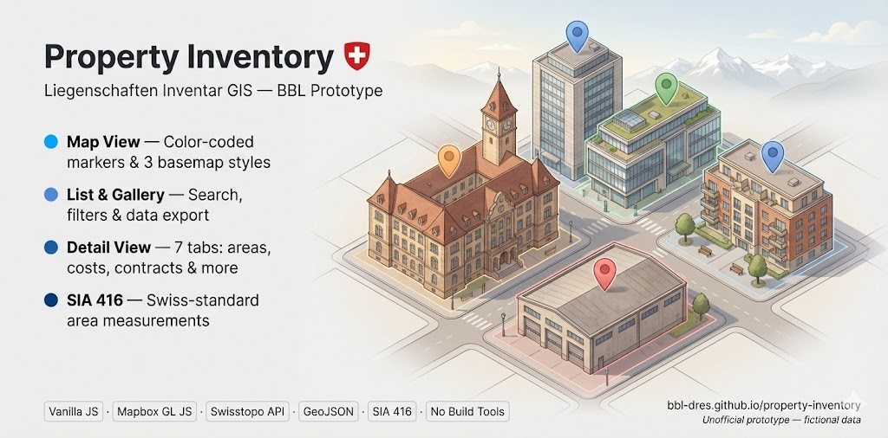
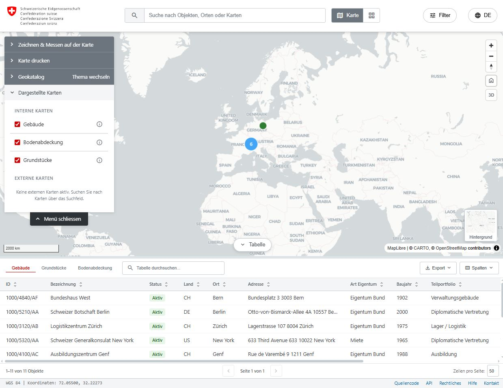
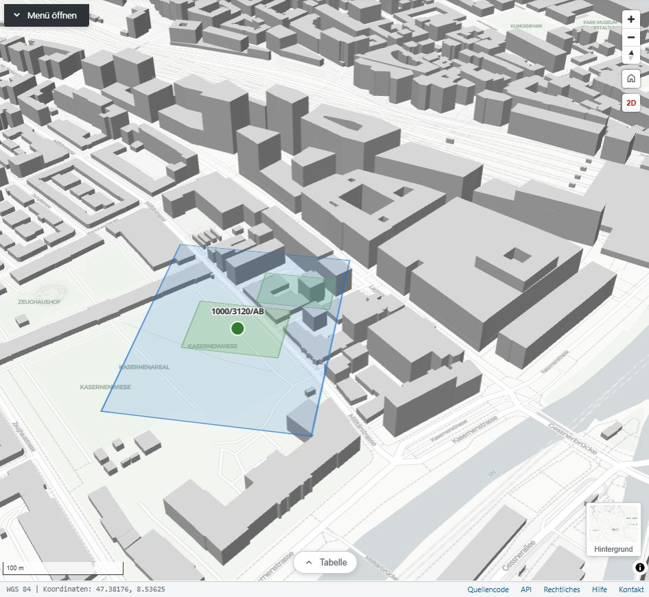
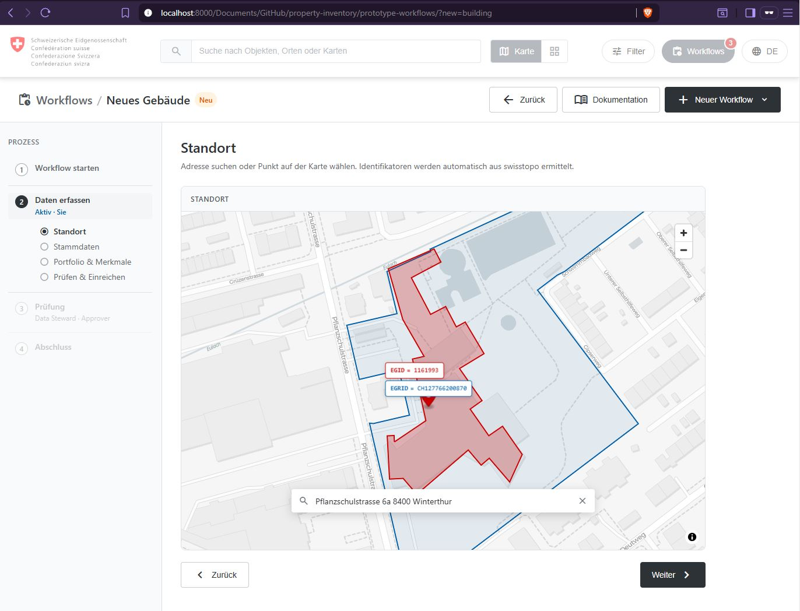

# Property Inventory / Liegenschaften Inventar



[](https://opensource.org/licenses/MIT)
[](https://bbl-dres.github.io/property-inventory/)
[](https://developer.mozilla.org/en-US/docs/Web/JavaScript)
[](https://maplibre.org/)
[](#running)

Interactive GIS web-app mockups for visualising and managing a real-estate portfolio. The repo holds **five independent prototypes**, each in its own folder with its own README.

> [!CAUTION]
> **Unofficial mockup for demonstration purposes only.**
> All data is fictional. Not all features are fully functional. This project is a visual and conceptual prototype — not intended for production use.

## Prototypes

### Main App

Read-only property inventory with map, list, and gallery views.
- Live app: https://bbl-dres.github.io/property-inventory/prototype-main/
- Source code: [`prototype-main/`](prototype-main/)

<p align="center">
  
  
</p>

---

### Tabs Views

Tabbed detail view with structured property sections and an AI agent for portfolio queries.
- Live app: https://bbl-dres.github.io/property-inventory/prototype-tabs/
- Source code: [`prototype-tabs/`](prototype-tabs/)

<p align="center">
  
  
</p>

---

### CR Workflows

Write operations (create, mutate, delete) with a four-eyes approval workflow and swisstopo API integration.
- Live app: https://bbl-dres.github.io/property-inventory/prototype-workflows/
- Source code: [`prototype-workflows/`](prototype-workflows/)

<p align="center">
  
</p>

---

### GIS Server

Lightweight frontend for managing layers, schemas, and feature data in a PostGIS-backed REST API.
- Live app: https://bbl-dres.github.io/property-inventory/prototype-backend/
- Source code: [`prototype-backend/`](prototype-backend/)

---

### OSM Height Enrichment

Browser-only tool that enriches OpenStreetMap buildings with accurate heights from Swiss elevation data.
- Live app: https://bbl-dres.github.io/property-inventory/osm-height/
- Source code: [`osm-height/`](osm-height/)

## Running

No build tools, no dependencies — just static files. From the repo root:

```bash
# Python
python -m http.server 8000

# Node
npx http-server

# PHP
php -S localhost:8000
```

Then open <http://localhost:8000/>. The root redirects to the main app; each prototype lives at its own path (e.g. `/prototype-tabs/`).

## Deployment

**GitHub Pages:** push to `main` deploys automatically. Alternatives: Netlify, Vercel, CloudFlare Pages, or any static file server.

## License

[MIT](https://opensource.org/licenses/MIT)
