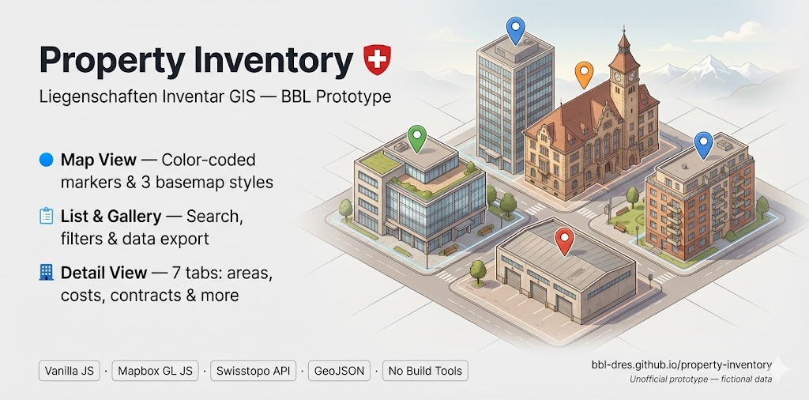
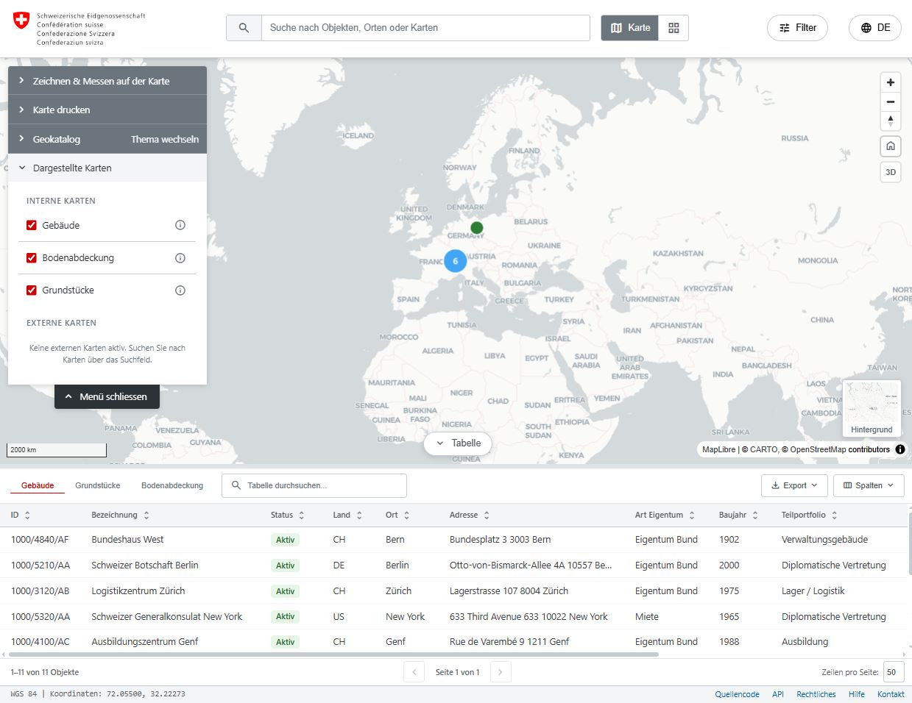
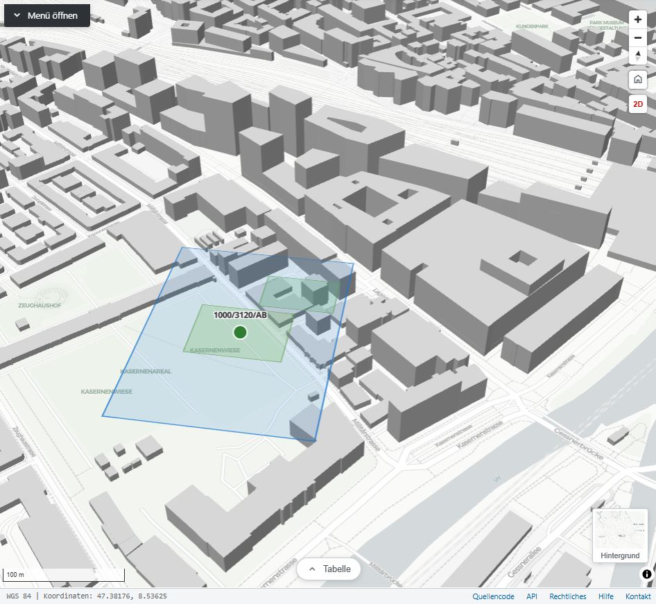

# Property Inventory / Liegenschaften Inventar



[](https://bbl-dres.github.io/property-inventory/)
[](LICENSE)

Five browser prototypes for exploring real-estate portfolio search, detail views,
approval workflows, GIS data management, and building-height enrichment.

> [!CAUTION]
> **Unofficial prototypes for demonstration purposes only.** Portfolio records and
> workflows are fictional mock content. The height-enrichment tool queries public
> OpenStreetMap and Swiss elevation services, so its results depend on upstream data.
> The tools are incomplete and are not intended for production use.

## Demo

**Main app:** https://bbl-dres.github.io/property-inventory/

<table border="0" cellpadding="0" cellspacing="0" role="presentation" width="100%">
  <tr>
    <td width="50%" valign="top"></td>
    <td width="50%" valign="top"></td>
  </tr>
</table>

The repository root opens the read-only property inventory.

## Prototypes

| Prototype | Purpose | Demo | Details |
|---|---|---|---|
| Main App | Read-only portfolio with map, list, and gallery views | [Open app](https://bbl-dres.github.io/property-inventory/prototype-main/) | [README](prototype-main/README.md) |
| Tabs Views | Structured property details and portfolio-query assistant | [Open app](https://bbl-dres.github.io/property-inventory/prototype-tabs/) | [README](prototype-tabs/README.md) |
| CR Workflows | Create, change, and delete flows with four-eyes approval | [Open app](https://bbl-dres.github.io/property-inventory/prototype-workflows/) | [README](prototype-workflows/README.md) |
| GIS Server | Layer, schema, and feature management frontend | [Open app](https://bbl-dres.github.io/property-inventory/prototype-backend/) | [README](prototype-backend/README.md) |
| OSM Height Enrichment | Adds Swiss elevation-derived heights to OSM buildings | [Open app](https://bbl-dres.github.io/property-inventory/osm-height/) | [README](osm-height/README.md) |

## Run locally

Serve the repository root with any static web server:

```bash
python -m http.server 8000
```

Then open <http://localhost:8000/>. The root redirects to the main app; each other
prototype is available at the path shown above.

## Documentation

Detailed features, setup, technology, and file layouts are documented in the
prototype READMEs linked in the table. The height-enrichment utility also has a
[Python implementation guide](osm-height/python_version/README.md).

## License

[MIT](LICENSE)
