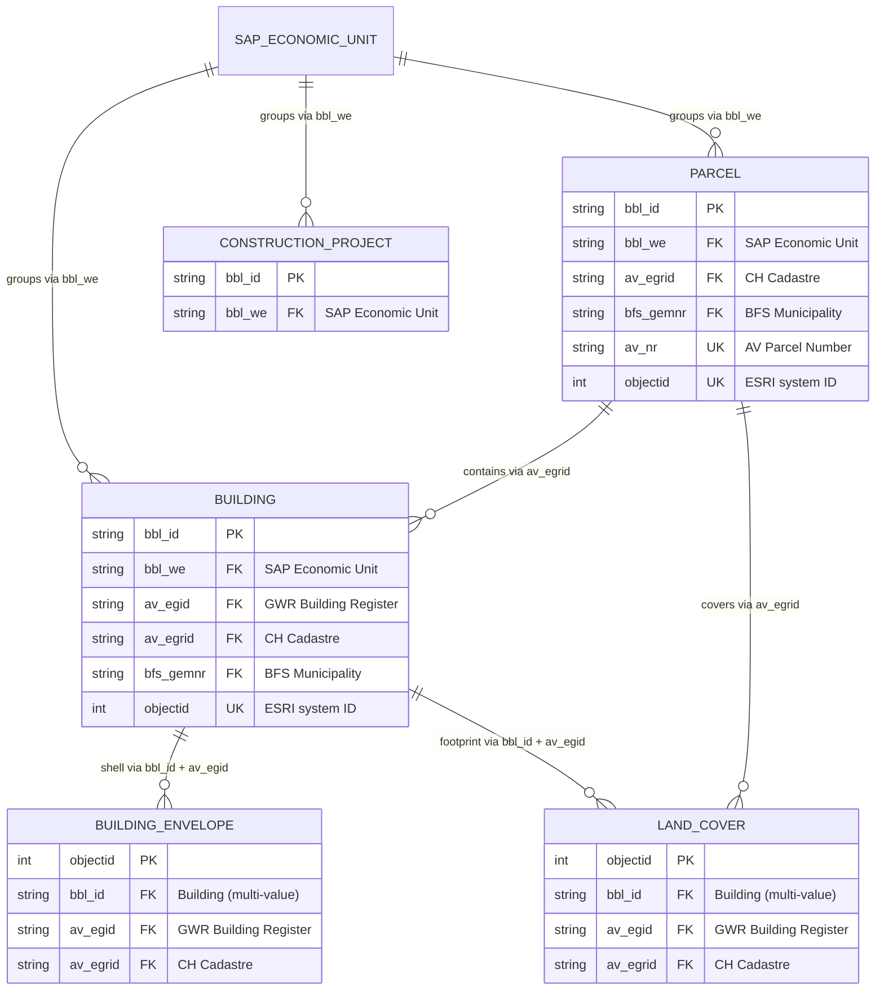

# BBL GIS IMMO - Data Model Specification

**Date:** 01-02-2025
**Application:** BBL GIS IMMO
**Source:** `BBL GIS IMMO 01-02-2025.xlsx`

---

## Overview

This document defines the attribute schema for the **BBL GIS IMMO** application, managing geospatial and real estate master data for the Swiss Federal Office for Buildings and Logistics (BBL / Bundesamt fur Bauten und Logistik).

### Business Objects

| # | EN | DE | PK | Geometry | Attributes | Status | Description |
|---|----|----|----|----|------------|--------|-------------|
| 1 | Building | Gebaude | bbl_id | Point | 74 | LIVE + DEV | Physical structures managed by BBL: master data, financials, SIA 416 dimensions, heritage status, workplace counts. Central entity linking to parcels via economic unit. |
| 2 | Land Cover | Bodenabdeckung | objectid | Polygon | 15 | LIVE | Ground surface polygons from official cadastral survey. Links building footprints to BBL IDs. Geometry sourced externally (AV/FID). |
| 3 | Parcel | Grundstuck | bbl_id | Polygon | 44 | LIVE + DEV | Land parcels with ownership, financials, SIA 416 land dimensions, sealed/green area metrics, and cadastral identifiers (EGRID, AV parcel number). |
| 4 | Building Envelope | Gebaudehulle | objectid | Polygon | 33 | DEV | 3D building shell geometry with floor area, volume, energy reference area (SIA 380), and envelope surfaces (eBKP-H roof/wall). Not yet in production. |
| 5 | Construction Project | Bauprojekt | bbl_id | Point | 30 | DEV | Active construction and renovation projects with SAP controlling data: timelines, costs, project classification. Not yet in production. |

### Conceptual Entity Relationships

> **Note:** `SAP_ECONOMIC_UNIT` is an external SAP RE-FX entity (not a BBL GIS IMMO feature layer). It is the commercial grouping that links Buildings, Parcels, and Construction Projects via the `bbl_we` foreign key. External registries (GWR, CH Cadastre, BFS, KGS) are referenced via FK but not modeled here.

### Foreign Key Targets

| FK Field | Source Layer(s) | Target System | Target Entity | Notes |
|----------|----------------|---------------|---------------|-------|
| bbl_we | Building, Parcel, Constr. Project | SAP RE-FX | Economic Unit (Wirtschaftseinheit) | Commercial grouping; links to contracts and cash flows |
| bbl_id | Land Cover, Building Envelope | BBL GIS IMMO | Building | Multi-value on Land Cover (semicolon-delimited, see note below) |
| av_egid | Building, Land Cover, Bldg. Envelope | CH GWR | Federal Building Register | Swiss building ID (EGID); CH-only properties |
| av_egrid | Building, Parcel, Land Cover, Bldg. Envelope | CH Cadastre | Federal Parcel Register | Swiss parcel ID (EGRID); CH-only properties |
| bfs_gemnr | Building, Parcel | BFS | Municipality Directory | Official municipality number |
| kgs_nr | Building | BABS | KGS Cultural Property Inventory | Heritage protection ID |
| fid | Land Cover, Building Envelope | Various | External Geometry DB | Architecture object ID for externally sourced geometry |

> **Multi-value FK:** Land Cover `bbl_id` (ID 74) concatenates multiple Building IDs with semicolons when a footprint polygon covers more than one BBL building. This breaks 1NF and prevents direct JOINs; consumers must parse the delimited string. Max cardinality is unbounded.

### Attribute Status

- `LIVE` — Production, actively used
- `DEV` — In development, not yet in production

### Key Types

| Key | Meaning |
|-----|---------|
| PK | Primary Key — uniquely identifies a record (`bbl_id` for Building, Parcel, Constr. Project; `objectid` for Land Cover, Building Envelope) |
| UK | Unique Key — unique constraint, but not the primary key |
| FK | Foreign Key — references an identifier in another system or layer (see FK Targets table) |

### Field Constraints

- **Field names:** Shapefile-compatible, max 10 characters, lowercase, underscore-separated. The **Len** column tracks character count.
- **Nullability:** PK fields are always required. FK fields are conditionally required (e.g., `av_egid` null for non-Swiss properties). All other fields are optional unless business rules dictate otherwise.
- **Value Lists:** The **VL** column names the coded-domain value list. Empty = free-form. Definitions in the Werteliste section.

---

## 1. Building (Gebaude)

### 1.1 Internal Master Data

| ID | Status | Alias EN | Alias DE | Field | Len | Type | Key | VL | Source | Desc EN | Desc DE |
|----|--------|----------|----------|-------|-----|------|-----|----|--------|---------|---------|
| 1 | LIVE | BBL Status | BBL Status | bbl_stat | 8 | String | | BBL_STATUS | RE-FX Building | Record status per SAP | Status entsprechend SAP |
| 2 | LIVE | BBL ID | BBL ID | bbl_id | 6 | String | PK | | RE-FX Building | Internal BBL ID (company code / economic unit / subobject) | Interne BBL ID (Buchungskreis/WE/Teilobjekt) |
| 3 | LIVE | BBL Company Code | BBL Buchungskreis | bbl_buch | 8 | String | | | RE-FX Building | Company code per SAP | Buchungskreis entsprechend SAP |
| 4 | LIVE | BBL Economic Unit | BBL Wirtschaftseinheit | bbl_we | 6 | String | FK | | RE-FX Building | Groups subobjects by commercial logic; linked to contracts and cash flows | Wirtschaftseinheit, gruppiert Teilobjekte nach kaufmannischer Logik |
| 5 | LIVE | BBL Subobject | BBL Teilobjekt | bbl_tobj | 8 | String | | | RE-FX Building | Subobject number, indexed per economic unit (e.g. AF) | Teilobjekt, pro Wirtschaftseinheit indexiert |
| 6 | LIVE | BBL Designation | BBL Bezeichnung | bbl_bez | 7 | String | | | RE-FX Building | Object name per SAP | Objektbezeichnung entsprechend SAP |
| 19 | LIVE | BBL Property Type | BBL Eigentum Art | bbl_eigen | 9 | String | | BBL_PROP_TYPE | RE-FX Building | Ownership type per SAP | Eigentum Art entsprechend SAP |
| 20 | LIVE | BBL Object Strategy | BBL Objektstrategie | bbl_ostr | 8 | String | | BBL_STRATEGY | RE-FX Building | Object strategy per SAP | Objektstrategie entsprechend SAP |
| 21 | LIVE | BBL Rental Model | BBL Mietmodell | bbl_mietm | 9 | String | | BBL_RENTAL | RE-FX Building | Rental model per SAP | Mietmodell entsprechend SAP |
| 22 | LIVE | BBL Construction Year | BBL Baujahr | bbl_bjahr | 9 | Integer | | | RE-FX Building | Year of construction | Baujahr |
| 23 | LIVE | BBL Sale Year | BBL Verkaufsjahr | bbl_vjahr | 9 | Integer | | | RE-FX Building | Year of sale (null if not sold) | Verkaufsjahr (leer wenn nicht verkauft) |
| 24 | LIVE | BBL Subportfolio | BBL Teilportfolio | bbl_port | 8 | String | | BBL_PORTFOLIO | RE-FX Building | Subportfolio assignment per SAP | Teilportfolio entsprechend SAP |
| 25 | LIVE | BBL Subportfolio Group | BBL Teilportfoliogruppe | bbl_port2 | 9 | String | | BBL_PORTF_GRP | RE-FX Building | Subportfolio group per SAP | Teilportfoliogruppe entsprechend SAP |
| 26 | LIVE | BBL Acquisition Value | BBL Anschaffungswert | bbl_awrt | 8 | Double | | | RE-FX Building | Acquisition value in CHF | Anschaffungswert in CHF |
| 27 | LIVE | BBL Book Value | BBL Buchwert | bbl_bwrt | 8 | Double | | | RE-FX Building | Net book value of building asset in CHF | Buchwert des Gebaudeanlageguts in CHF |
| 28 | LIVE | BBL Building Type 1 | BBL Gebaudeart 1 | bbl_gbda1 | 9 | String | | BBL_BLDG_TYP1 | RE-FX Building | Building type level 1 | Gebaudeart Stufe 1 |
| 29 | LIVE | BBL Building Type 2 | BBL Gebaudeart 2 | bbl_gbda2 | 9 | String | | BBL_BLDG_TYP2 | RE-FX Building | Building type level 2 | Gebaudeart Stufe 2 |
| 30 | LIVE | BBL Object Responsible | BBL Objektverantwortlich | bbl_ovtw | 8 | String | | | RE-FX Building | Responsible person per SAP | Objektverantwortliche Person |
| 31 | LIVE | BBL Portfolio Manager | BBL Portfoliomanager | bbl_pvtw | 8 | String | | | RE-FX Building | Portfolio manager per SAP | Portfoliomanager entsprechend SAP |

### 1.2 Cleaning - DEV

| ID | Status | Alias EN | Alias DE | Field | Len | Type | Key | VL | Source | Desc EN | Desc DE |
|----|--------|----------|----------|-------|-----|------|-----|----|--------|---------|---------|
| 32 | DEV | Cleaning Group | Reinigung Gruppe | bbl_rgrp | 8 | String | | BBL_CLEAN_GRP | BBL Cleaning Excel | Cleaning group assignment | Reinigungsgruppe |
| 33 | DEV | Cleaning Window Area | Reinigung Fensterflache | garea_rff | 9 | Double | | | RE-FX Building | Window area for cleaning in m2 | Fensterflache fur Reinigung in m2 |
| 34 | DEV | Cleaning Glass Area | Reinigung Glasflache | garea_rgf | 9 | Double | | | RE-FX Building | Glass area for cleaning in m2 | Glasflache fur Reinigung in m2 |

### 1.3 Address

| ID | Status | Alias EN | Alias DE | Field | Len | Type | Key | VL | Source | Desc EN | Desc DE |
|----|--------|----------|----------|-------|-----|------|-----|----|--------|---------|---------|
| 7 | LIVE | Country | Land | adr_land | 8 | String | | ISO_3166 | RE-FX Building | Country | Land |
| 8 | LIVE | Region | Region | adr_reg | 7 | String | | REGION | RE-FX Building | Region (international) or Canton (CH) | Region oder Kanton |
| 9 | LIVE | City / Town | Ort | adr_ort | 7 | String | | | RE-FX Building | City or town | Ort |
| 10 | LIVE | Postal Code | Postleitzahl | adr_plz | 7 | String | | | RE-FX Building | Postal code | Postleitzahl |
| 11 | LIVE | Street | Strasse | adr_str | 7 | String | | | RE-FX Building | Street name | Strasse |
| 12 | LIVE | House Number | Hausnummer | adr_hsnr | 8 | String | | | RE-FX Building | House number | Hausnummer |
| 13 | LIVE | Address | Adresse | adr_conct | 9 | String | | | Derived | Concatenated from adr_str + adr_hsnr + adr_plz + adr_ort, no separators | Verkettet aus Adressfeldern, ohne Trennzeichen |

### 1.4 Coordinates

| ID | Status | Alias EN | Alias DE | Field | Len | Type | Key | VL | Source | Desc EN | Desc DE |
|----|--------|----------|----------|-------|-----|------|-----|----|--------|---------|---------|
| 14 | LIVE | WGS84 Latitude | WGS84 Latitude | wgs84_lat | 9 | Double | | | RE-FX Building | WGS84 latitude | Breitengrad WGS84 |
| 15 | LIVE | WGS84 Longitude | WGS84 Longitude | wgs84_lon | 9 | Double | | | RE-FX Building | WGS84 longitude | Langengrad WGS84 |
| 182 | LIVE | LV95 E | LV95 E | lv95_e | 6 | Double | | | Auto | LV95 easting, derived from WGS84 | LV95 Ost, aus WGS84 hergeleitet |
| 183 | LIVE | LV95 N | LV95 N | lv95_n | 6 | Double | | | Auto | LV95 northing, derived from WGS84 | LV95 Nord, aus WGS84 hergeleitet |
| 18 | LIVE | EGM Elevation | EGM Hohe | egm_elev | 8 | Double | | | Elevation Models | Absolute elevation in meters (EGM2008 geoid) | Absolute Hohe in Meter (EGM2008) |

### 1.5 Official Survey

| ID | Status | Alias EN | Alias DE | Field | Len | Type | Key | VL | Source | Desc EN | Desc DE |
|----|--------|----------|----------|-------|-----|------|-----|----|--------|---------|---------|
| 35 | LIVE | AV EGID | AV EGID | av_egid | 7 | String | FK | | CH Official Survey | Federal building ID per GWR (CH only) | Eidg. Gebaudeidentifikator (nur CH) |
| 36 | LIVE | AV EGRID | AV EGRID | av_egrid | 8 | String | FK | | CH Official Survey | Federal parcel ID per cadastre.ch (CH only) | Eidg. Grundstuckidentifikator (nur CH) |
| 37 | LIVE | BFS Municipality Name | BFS Gemeindename | bfs_gem | 7 | String | | | CH GWR | Municipality name per BFS directory | BFS Gemeindename |
| 38 | LIVE | BFS Municipality Number | BFS Gemeindennummer | bfs_gemnr | 9 | String | FK | | CH GWR | Municipality number per BFS directory | BFS Gemeindenummer |
| 39 | LIVE | AV Zoning Designation | AV Bauzone Bezeichnung | av_zbez | 7 | String | | | CH Zoning | Construction zone name (ARE / cantonal) | Bauzonenbezeichnung (ARE / Kantone) |
| 40 | LIVE | AV Zoning Usage | AV Bauzone Nutzung | av_znut | 7 | String | | | CH Zoning | Construction zone usage type | Bauzonennutzung |
| 41 | DEV | AV Natural Hazards | AV Naturgefahren | av_nrisk | 8 | String | | | CH Zoning | Natural hazard classification | Naturgefahren-Klassifikation |

### 1.6 Heritage Protection

| ID | Status | Alias EN | Alias DE | Field | Len | Type | Key | VL | Source | Desc EN | Desc DE |
|----|--------|----------|----------|-------|-----|------|-----|----|--------|---------|---------|
| 42 | LIVE | BBL Historical Collection | BBL Historische Ausstattung | bbl_hist | 8 | String | | BBL_HISTORICAL | RE-FX Building | Historical furnishing classification | Historische Ausstattung |
| 43 | LIVE | BBL Archival Value | BBL Archivwurdigkeit | bbl_arch | 8 | String | | BBL_ARCHIVAL | RE-FX Building | Archival value classification | Archivwurdigkeit |
| 44 | LIVE | BABS KGS Category | BABS KGS Kategorie | kgs_kat | 7 | String | | KGS_CATEGORY | CH KGS Inventory | Cultural property protection category | KGS-Inventar Kategorie |
| 45 | LIVE | BABS KGS Number | BABS KGS Nummer | kgs_nr | 6 | Integer | FK | | CH KGS Inventory | Cultural property protection ID | KGS-Inventar ID |

### 1.7 Workplaces - DEV

| ID | Status | Alias EN | Alias DE | Field | Len | Type | Key | VL | Source | Desc EN | Desc DE |
|----|--------|----------|----------|-------|-----|------|-----|----|--------|---------|---------|
| 47 | DEV | Count WP Actual | Anzahl AP IST | bbl_api | 7 | Integer | | | BBL SAP Korasoft | Current workplace count | Aktuelle Anzahl Arbeitsplatze |
| 48 | DEV | Count WP Reserve | Anzahl AP Reserve | bbl_apr | 7 | Integer | | | BBL SAP Korasoft | Reserve workplace count | Anzahl Reserve-Arbeitsplatze |
| 49 | DEV | Count WP Target | Anzahl AP Soll | bbl_aps | 7 | Integer | | | BBL SAP Korasoft | Target workplace count | Soll-Anzahl Arbeitsplatze |

### 1.8 Dimensions - SIA 416

| ID | Status | Alias EN | Alias DE | Field | Len | Type | Key | VL | Source | Desc EN | Desc DE |
|----|--------|----------|----------|-------|-----|------|-----|----|--------|---------|---------|
| 50 | LIVE | Floor Area GF | Geschossflache GF | garea_gf | 8 | Double | | | RE-FX, Estimate | Total floor area GF (SIA 416) in m2 | Geschossflache GF Total in m2 |
| 51 | LIVE | Above-Ground Floor Area | GF Oberirdisch | garea_gfo | 9 | Double | | | RE-FX, Estimate | Above-ground GF (SIA 416) in m2 | GF Oberirdisch in m2 |
| 52 | LIVE | Underground Floor Area | GF Unterirdisch | garea_gfu | 9 | Double | | | RE-FX, Estimate | Underground GF (SIA 416) in m2 | GF Unterirdisch in m2 |
| 53 | LIVE | Floor Area Accuracy | Geschossflache Genauigkeit | garea_acu | 9 | String | | ACCURACY | RE-FX, Estimate | Accuracy and data origin of area | Genauigkeit und Datenherkunft |
| 54 | LIVE | Net Floor Area NGF | Netto-Geschossflache NGF | garea_ngf | 9 | Double | | | RE-FX, Estimate | Net floor area NGF (SIA 416) in m2 | Netto-Geschossflache in m2 |
| 55 | LIVE | Usable Area NF | Nutzflache NF | garea_nf | 8 | Double | | | RE-FX, Estimate | Usable area NF (SIA 416) in m2 | Nutzflache in m2 |
| 56 | LIVE | Main Usable Area HNF | Hauptnutzflache HNF | garea_hnf | 9 | Double | | | RE-FX, Estimate | Main usable area HNF (SIA 416) in m2 | Hauptnutzflache in m2 |
| 57 | LIVE | Ancillary Area NNF | Nebennutzflache NNF | garea_nnf | 9 | Double | | | RE-FX, Estimate | Ancillary usable area NNF (SIA 416) in m2 | Nebennutzflache in m2 |
| 58 | LIVE | Functional Area FF | Funktionsflache FF | garea_ff | 8 | Double | | | RE-FX, Estimate | Functional area FF (SIA 416) in m2 | Funktionsflache in m2 |
| 59 | LIVE | Traffic Area VF | Verkehrsflache VF | garea_vf | 8 | Double | | | RE-FX, Estimate | Traffic/circulation area VF (SIA 416) in m2 | Verkehrsflache in m2 |
| 60 | LIVE | Rentable Area VMF | Vermietbare Flache VMF | garea_vmf | 9 | Double | | | RE-FX, Estimate | Rentable area VMF (SIA 416) in m2 | Vermietbare Flache in m2 |
| 62 | LIVE | Building Volume GV | Gebaudevolumen GV | gvol_gv | 7 | Double | | | RE-FX, Estimate | Building volume GV (SIA 416) in m3 | Gebaudevolumen GV in m3 |
| 63 | LIVE | Above-Ground Volume | GV Oberirdisch | gvol_gvo | 8 | Double | | | RE-FX, Estimate | Above-ground volume (SIA 416) in m3 | GV Oberirdisch in m3 |
| 64 | LIVE | Underground Volume | GV Unterirdisch | gvol_gvu | 8 | Double | | | RE-FX, Estimate | Underground volume (SIA 416) in m3 | GV Unterirdisch in m3 |
| 65 | LIVE | Volume Accuracy | Gebaudevolumen Genauigkeit | gvol_acu | 8 | String | | ACCURACY | RE-FX, Estimate | Accuracy and data origin of volume | Genauigkeit und Datenherkunft |
| 66 | LIVE | Number of Floors | Anzahl Geschosse | gastw | 5 | Integer | | | RE-FX, Estimate | Total floor count | Anzahl Geschosse Total |
| 67 | LIVE | Above-Ground Floors | Geschosse Oberirdisch | gastw_og | 8 | Integer | | | RE-FX, Estimate | Above-ground floor count | Geschosse Oberirdisch |
| 68 | LIVE | Underground Floors | Geschosse Unterirdisch | gastw_ug | 8 | Integer | | | RE-FX, Estimate | Underground floor count | Geschosse Unterirdisch |
| 69 | LIVE | Floor Count Accuracy | Geschosse Genauigkeit | gastw_acu | 9 | String | | ACCURACY | RE-FX, Estimate | Accuracy and data origin of floor count | Genauigkeit und Datenherkunft |
| 70 | LIVE | Building Footprint GGF | Gebaudegrundflache GGF | larea_ggf | 9 | Double | | | CH Official Survey | Building footprint GGF (SIA 416) in m2 | Gebaudegrundflache in m2 |
| 71 | LIVE | Parcel Area GSF | Grundstucksflache GSF | larea_gsf | 9 | Double | | | CH Official Survey | Parcel area GSF (SIA 416) in m2 | Grundstucksflache in m2 |
| 72 | LIVE | Surrounding Area UF | Umgebungsflache UF | larea_uf | 8 | Double | | | CH Official Survey | Surrounding area UF (SIA 416) in m2 | Umgebungsflache in m2 |
| 73 | LIVE | Land Area Accuracy | Grundstucksflache Genauigkeit | larea_acu | 9 | String | | ACCURACY | CH Official Survey | Accuracy and data origin of land area | Genauigkeit und Datenherkunft |

### 1.9 Dimensions - SIA 380

| ID | Status | Alias EN | Alias DE | Field | Len | Type | Key | VL | Source | Desc EN | Desc DE |
|----|--------|----------|----------|-------|-----|------|-----|----|--------|---------|---------|
| 61 | LIVE | Energy Reference Area EBF | Energiebezugsflache EBF | garea_ebf | 9 | Double | | | RE-FX, Estimate | Energy reference area EBF (SIA 380) in m2 | Energiebezugsflache in m2 |

### 1.10 Other

| ID | Status | Alias EN | Alias DE | Field | Len | Type | Key | VL | Source | Desc EN | Desc DE |
|----|--------|----------|----------|-------|-----|------|-----|----|--------|---------|---------|
| 46 | LIVE | OBJECTID | OBJECTID | objectid | 8 | Integer | UK | | Auto | ESRI system ID for GIS updates | ESRI ID fur GIS-Updates |
| 192 | LIVE | ETL Timestamp | ETL Zeitstempel | etl_ts | 6 | Date | | | Auto | Timestamp of last ETL sync from source systems | Zeitstempel der letzten ETL-Synchronisation |

---

## 2. Land Cover (Bodenabdeckung)

### 2.1 Internal Master Data

| ID | Status | Alias EN | Alias DE | Field | Len | Type | Key | VL | Source | Desc EN | Desc DE |
|----|--------|----------|----------|-------|-----|------|-----|----|--------|---------|---------|
| 74 | LIVE | BBL ID | BBL ID | bbl_id | 6 | String | FK | | RE-FX Building | Internal BBL ID; semicolon-delimited if polygon covers multiple buildings | Interne BBL ID; Semikolon-getrennt bei Mehrfachzuordnung |

### 2.2 Official Survey

| ID | Status | Alias EN | Alias DE | Field | Len | Type | Key | VL | Source | Desc EN | Desc DE |
|----|--------|----------|----------|-------|-----|------|-----|----|--------|---------|---------|
| 75 | LIVE | AV Status | AV Status | av_stat | 7 | String | | AV_STATUS | CH Official Survey | Building footprint status per GWR (CH only) | Status entsprechend GWR (nur CH) |
| 76 | LIVE | AV EGID | AV EGID | av_egid | 7 | String | FK | | CH Official Survey | Federal building ID per GWR (CH only) | Eidg. Gebaudeidentifikator (nur CH) |
| 77 | LIVE | AV EGRID | AV EGRID | av_egrid | 8 | String | FK | | CH Official Survey | Federal parcel ID per cadastre.ch (CH only) | Eidg. Grundstuckidentifikator (nur CH) |
| 78 | LIVE | AV Type | AV Typ | av_type | 7 | String | | AV_COVER_TYPE | CH Official Survey | Land cover type per official survey | Bodenabdeckungstyp |

### 2.3 Coordinates

| ID | Status | Alias EN | Alias DE | Field | Len | Type | Key | VL | Source | Desc EN | Desc DE |
|----|--------|----------|----------|-------|-----|------|-----|----|--------|---------|---------|
| 79 | LIVE | WGS84 Latitude | WGS84 Latitude | wgs84_lat | 9 | Double | | | CH Official Survey | WGS84 latitude | Breitengrad WGS84 |
| 80 | LIVE | WGS84 Longitude | WGS84 Longitude | wgs84_lon | 9 | Double | | | CH Official Survey | WGS84 longitude | Langengrad WGS84 |
| 184 | LIVE | LV95 E | LV95 E | lv95_e | 6 | Double | | | Auto | LV95 easting, derived from WGS84 | LV95 Ost, aus WGS84 hergeleitet |
| 185 | LIVE | LV95 N | LV95 N | lv95_n | 6 | Double | | | Auto | LV95 northing, derived from WGS84 | LV95 Nord, aus WGS84 hergeleitet |

### 2.4 Other

| ID | Status | Alias EN | Alias DE | Field | Len | Type | Key | VL | Source | Desc EN | Desc DE |
|----|--------|----------|----------|-------|-----|------|-----|----|--------|---------|---------|
| 81 | LIVE | FID | FID | fid | 3 | String | FK | | Various | External geometry object ID | Architektur-Objekt-ID fur externe Geometrie |
| 82 | LIVE | FID Source | FID Quelle | fid_src | 7 | String | | | Various | Source of external geometry | Quelle der Geometrie |
| 83 | LIVE | OBJECTID | OBJECTID | objectid | 8 | Integer | PK | | Auto | ESRI system ID for GIS updates | ESRI ID fur GIS-Updates |
| 193 | LIVE | ETL Timestamp | ETL Zeitstempel | etl_ts | 6 | Date | | | Auto | Timestamp of last ETL sync | Zeitstempel der letzten ETL-Synchronisation |

---

## 3. Parcel (Grundstuck)

### 3.1 Internal Master Data

| ID | Status | Alias EN | Alias DE | Field | Len | Type | Key | VL | Source | Desc EN | Desc DE |
|----|--------|----------|----------|-------|-----|------|-----|----|--------|---------|---------|
| 84 | LIVE | BBL Status | Status | bbl_stat | 8 | String | | BBL_STATUS | RE-FX Parcel | Record status per SAP | Status entsprechend SAP |
| 85 | LIVE | BBL ID | BBL ID | bbl_id | 6 | String | PK | | RE-FX Parcel | Internal BBL ID (company code / economic unit / subobject) | Interne BBL ID (Buchungskreis/WE/Teilobjekt) |
| 86 | LIVE | BBL Company Code | BBL Buchungskreis | bbl_buch | 8 | String | | | RE-FX Parcel | Company code per SAP | Buchungskreis entsprechend SAP |
| 87 | LIVE | BBL Economic Unit | BBL Wirtschaftseinheit | bbl_we | 6 | String | FK | | RE-FX Parcel | Groups subobjects by commercial logic | Wirtschaftseinheit |
| 88 | LIVE | BBL Subobject | BBL Teilobjekt | bbl_tobj | 8 | String | | | RE-FX Parcel | Subobject number (e.g. AF) | Teilobjekt |
| 89 | LIVE | BBL Designation | BBL Bezeichnung | bbl_bez | 7 | String | | | RE-FX Parcel | Object name per SAP | Objektbezeichnung |
| 90 | LIVE | BBL Subportfolio | BBL Teilportfolio | bbl_port | 8 | String | | BBL_PORTFOLIO | RE-FX Parcel | Subportfolio assignment | Teilportfolio-Zuordnung |
| 91 | LIVE | BBL Rental Model | BBL Mietmodell | bbl_mietm | 9 | String | | BBL_RENTAL | RE-FX Parcel | Rental model per SAP | Mietmodell entsprechend SAP |
| 92 | LIVE | BBL Property Type | BBL Eigentum Art | bbl_eigen | 9 | String | | BBL_PROP_TYPE | RE-FX Parcel | Ownership type per SAP | Eigentum Art entsprechend SAP |
| 105 | LIVE | BBL Acquisition Value | BBL Anschaffungswert | bbl_awrt | 8 | Double | | | RE-FX Parcel | Acquisition value in CHF | Anschaffungswert in CHF |
| 106 | LIVE | BBL Book Value | BBL Buchwert | bbl_bwrt | 8 | Double | | | RE-FX Parcel | Cumulative construction expenditure on parcel in CHF | Kumulierte Baumassnahmen am Grundstuck in CHF |
| 107 | LIVE | Historical Garden | Historischer Garten | bbl_hgart | 9 | Boolean | | | BBL SAP Property Inv. | Designated as historical garden | Kennzeichnung als historischer Garten |

### 3.2 Address

| ID | Status | Alias EN | Alias DE | Field | Len | Type | Key | VL | Source | Desc EN | Desc DE |
|----|--------|----------|----------|-------|-----|------|-----|----|--------|---------|---------|
| 93 | LIVE | Country | Land | adr_land | 8 | String | | ISO_3166 | RE-FX Parcel | Country | Land |
| 94 | LIVE | Region | Region | adr_reg | 7 | String | | REGION | RE-FX Parcel | Region (international) or Canton (CH) | Region oder Kanton |
| 95 | LIVE | City / Town | Ort | adr_ort | 7 | String | | | RE-FX Parcel | City or town | Ort |
| 96 | LIVE | Postal Code | Postleitzahl | adr_plz | 7 | String | | | RE-FX Parcel | Postal code | Postleitzahl |
| 97 | LIVE | Street | Strasse | adr_str | 7 | String | | | RE-FX Parcel | Street name | Strasse |
| 98 | LIVE | House Number | Hausnummer | adr_hsnr | 8 | String | | | RE-FX Parcel | House number | Hausnummer |
| 99 | LIVE | Address | Adresse | adr_conct | 9 | String | | | Derived | Concatenated from adr_str + adr_hsnr + adr_plz + adr_ort, no separators | Verkettet aus Adressfeldern, ohne Trennzeichen |

### 3.3 Coordinates

| ID | Status | Alias EN | Alias DE | Field | Len | Type | Key | VL | Source | Desc EN | Desc DE |
|----|--------|----------|----------|-------|-----|------|-----|----|--------|---------|---------|
| 100 | LIVE | WGS84 Latitude | WGS84 Latitude | wgs84_lat | 9 | Double | | | RE-FX Parcel | WGS84 latitude (point-in-polygon) | Breitengrad WGS84 (Punkt im Polygon) |
| 101 | LIVE | WGS84 Longitude | WGS84 Longitude | wgs84_lon | 9 | Double | | | RE-FX Parcel | WGS84 longitude (point-in-polygon) | Langengrad WGS84 (Punkt im Polygon) |
| 186 | LIVE | LV95 E | LV95 E | lv95_e | 6 | Double | | | Auto | LV95 easting, derived from WGS84 | LV95 Ost, aus WGS84 hergeleitet |
| 187 | LIVE | LV95 N | LV95 N | lv95_n | 6 | Double | | | Auto | LV95 northing, derived from WGS84 | LV95 Nord, aus WGS84 hergeleitet |
| 102 | LIVE | EGM Elevation | EGM Hohe | egm_elev | 8 | Double | | | Auto | Absolute elevation in meters (EGM2008 geoid) | Absolute Hohe in Meter (EGM2008) |

### 3.4 Official Survey

| ID | Status | Alias EN | Alias DE | Field | Len | Type | Key | VL | Source | Desc EN | Desc DE |
|----|--------|----------|----------|-------|-----|------|-----|----|--------|---------|---------|
| 103 | LIVE | AV Status | AV Status | av_stat | 7 | String | | AV_STATUS | CH Official Survey | Status per official survey | Status Amtliche Vermessung |
| 104 | LIVE | AV EGRID | AV EGRID | av_egrid | 8 | String | FK | | CH Official Survey | Federal parcel ID (CH only) | Eidg. Grundstuckidentifikator (nur CH) |
| 116 | LIVE | BFS Municipality Name | BFS Gemeindename | bfs_gem | 7 | String | | | CH Official Survey | Municipality name per BFS | BFS Gemeindename |
| 117 | LIVE | BFS Municipality Number | BFS Gemeindennummer | bfs_gemnr | 9 | String | FK | | CH Official Survey | Municipality number per BFS | BFS Gemeindenummer |
| 118 | LIVE | AV Parcel Number | AV Grundstucksnummer | av_nr | 5 | String | UK | | CH Official Survey | Parcel number per municipality (unique with bfs_gemnr) | Grundstucksnummer pro Gemeinde |
| 119 | LIVE | AV Zoning Designation | AV Bauzone Bezeichnung | av_zbez | 7 | String | | | CH Zoning | Construction zone name (ARE / cantonal) | Bauzonenbezeichnung |
| 120 | LIVE | AV Zoning Usage | AV Bauzone Nutzung | av_znut | 7 | String | | | CH Official Survey | Construction zone usage type | Bauzonennutzung |
| 121 | DEV | AV Natural Hazards | AV Naturgefahren | av_nrisk | 8 | String | | | CH Zoning | Natural hazard classification | Naturgefahren-Klassifikation |

### 3.5 Dimensions - SIA 416

| ID | Status | Alias EN | Alias DE | Field | Len | Type | Key | VL | Source | Desc EN | Desc DE |
|----|--------|----------|----------|-------|-----|------|-----|----|--------|---------|---------|
| 108 | LIVE | Building Footprint GGF | Gebaudegrundflache GGF | larea_ggf | 9 | Double | | | CH Official Survey | Sum building footprint per parcel in m2 | Summe Gebaudegrundflache pro Grundstuck in m2 |
| 109 | LIVE | Parcel Area GSF | Grundstucksflache GSF | larea_gsf | 9 | Double | | | CH Official Survey | Parcel area GSF (SIA 416) in m2 | Grundstucksflache in m2 |
| 110 | LIVE | Surrounding Area UF | Umgebungsflache UF | larea_uf | 8 | Double | | | CH Official Survey | Surrounding area per parcel in m2 | Umgebungsflache pro Grundstuck in m2 |
| 111 | LIVE | Processed Surrounding BUF | Bearbeitete Umgebungsflache BUF | larea_buf | 9 | Double | | | CH Official Survey | Processed surrounding area per parcel in m2 | Bearbeitete Umgebungsflache in m2 |
| 112 | LIVE | Unprocessed Surrounding UUF | Unbearbeitete Umgebungsflache UUF | larea_uuf | 9 | Double | | | CH Official Survey | Unprocessed surrounding area per parcel in m2 | Unbearbeitete Umgebungsflache in m2 |
| 113 | LIVE | Land Area Accuracy | Grundstucksflache Genauigkeit | larea_acu | 9 | String | | ACCURACY | CH Official Survey | Accuracy and data origin | Genauigkeit und Datenherkunft |

### 3.6 Other Dimensions

| ID | Status | Alias EN | Alias DE | Field | Len | Type | Key | VL | Source | Desc EN | Desc DE |
|----|--------|----------|----------|-------|-----|------|-----|----|--------|---------|---------|
| 114 | LIVE | Sealed Area | Versiegelte Flache | larea_ver | 9 | Double | | | CH Official Survey | Sealed surface per parcel in m2 | Versiegelte Flache pro Grundstuck in m2 |
| 115 | LIVE | Green Space | Grunflache | larea_gre | 9 | Double | | | CH Official Survey | Green space, basis for "nature-oriented care" analysis | Grunflachen, Grundlage fur Auswertung |

### 3.7 Other

| ID | Status | Alias EN | Alias DE | Field | Len | Type | Key | VL | Source | Desc EN | Desc DE |
|----|--------|----------|----------|-------|-----|------|-----|----|--------|---------|---------|
| 122 | LIVE | FID | FID | fid | 3 | String | FK | | CH Official Survey | External geometry object ID | Architektur-Objekt-ID fur externe Geometrie |
| 123 | LIVE | FID Source | FID Quelle | fid_src | 7 | String | | | CH Official Survey | Source of external geometry | Quelle der Geometrie |
| 124 | LIVE | OBJECTID | OBJECTID | objectid | 8 | Integer | UK | | Auto | ESRI system ID for GIS updates | ESRI ID fur GIS-Updates |
| 194 | LIVE | ETL Timestamp | ETL Zeitstempel | etl_ts | 6 | Date | | | Auto | Timestamp of last ETL sync | Zeitstempel der letzten ETL-Synchronisation |

---

## 4. Building Envelope (Gebaudehulle) - DEV

### 4.1 Internal Master Data

| ID | Status | Alias EN | Alias DE | Field | Len | Type | Key | VL | Source | Desc EN | Desc DE |
|----|--------|----------|----------|-------|-----|------|-----|----|--------|---------|---------|
| 125 | DEV | BBL ID | BBL ID | bbl_id | 6 | String | FK | | BBL SAP Property Inv. | Internal BBL ID; semicolon-delimited if multiple apply | Interne BBL ID; Semikolon-getrennt bei Mehrfachzuordnung |

### 4.2 Official Survey

| ID | Status | Alias EN | Alias DE | Field | Len | Type | Key | VL | Source | Desc EN | Desc DE |
|----|--------|----------|----------|-------|-----|------|-----|----|--------|---------|---------|
| 126 | DEV | AV Status | AV Status | av_stat | 7 | String | | AV_STATUS | CH Official Survey | Status per official survey | Status Amtliche Vermessung |
| 127 | DEV | AV EGID | AV EGID | av_egid | 7 | String | FK | | CH Official Survey | Federal building ID per GWR (CH only) | Eidg. Gebaudeidentifikator (nur CH) |
| 128 | DEV | AV EGRID | AV EGRID | av_egrid | 8 | String | FK | | CH Official Survey | Federal parcel ID (CH only) | Eidg. Grundstuckidentifikator (nur CH) |

### 4.3 Address

| ID | Status | Alias EN | Alias DE | Field | Len | Type | Key | VL | Source | Desc EN | Desc DE |
|----|--------|----------|----------|-------|-----|------|-----|----|--------|---------|---------|
| 129 | DEV | Country | Land | adr_land | 8 | String | | ISO_3166 | BFS GWR, RE-FX | Country | Land |
| 130 | DEV | Region | Region | adr_reg | 7 | String | | REGION | BFS GWR, RE-FX | Region (international) or Canton (CH) | Region oder Kanton |
| 131 | DEV | City / Town | Ort | adr_ort | 7 | String | | | BFS GWR, RE-FX | City or town | Ort |
| 132 | DEV | Postal Code | Postleitzahl | adr_plz | 7 | String | | | BFS GWR, RE-FX | Postal code | Postleitzahl |
| 133 | DEV | Street | Strasse | adr_str | 7 | String | | | BFS GWR, RE-FX | Street name | Strasse |
| 134 | DEV | House Number | Hausnummer | adr_hsnr | 8 | String | | | BFS GWR, RE-FX | House number | Hausnummer |
| 135 | DEV | Address | Adresse | adr_conct | 9 | String | | | Derived | Concatenated address | Adresse verkettet |

### 4.4 Coordinates

| ID | Status | Alias EN | Alias DE | Field | Len | Type | Key | VL | Source | Desc EN | Desc DE |
|----|--------|----------|----------|-------|-----|------|-----|----|--------|---------|---------|
| 136 | DEV | WGS84 Latitude | WGS84 Latitude | wgs84_lat | 9 | Double | | | BFS GWR, RE-FX | WGS84 latitude | Breitengrad WGS84 |
| 137 | DEV | WGS84 Longitude | WGS84 Longitude | wgs84_lon | 9 | Double | | | BFS GWR, RE-FX | WGS84 longitude | Langengrad WGS84 |
| 188 | DEV | LV95 E | LV95 E | lv95_e | 6 | Double | | | Auto | LV95 easting, derived from WGS84 | LV95 Ost, aus WGS84 hergeleitet |
| 189 | DEV | LV95 N | LV95 N | lv95_n | 6 | Double | | | Auto | LV95 northing, derived from WGS84 | LV95 Nord, aus WGS84 hergeleitet |
| 138 | DEV | EGM Elevation | EGM Hohe | egm_elev | 8 | Double | | | Elevation Models | Absolute elevation in meters (EGM2008 geoid) | Absolute Hohe in Meter (EGM2008) |

### 4.5 Dimensions - SIA 416

| ID | Status | Alias EN | Alias DE | Field | Len | Type | Key | VL | Source | Desc EN | Desc DE |
|----|--------|----------|----------|-------|-----|------|-----|----|--------|---------|---------|
| 139 | DEV | Floor Area GF | Geschossflache GF | garea_gf | 8 | Double | | | RE-FX, Estimate | Total floor area GF (SIA 416) in m2 | Geschossflache GF Total in m2 |
| 140 | DEV | Floor Area Accuracy | Geschossflache Genauigkeit | garea_acu | 9 | String | | ACCURACY | RE-FX, Estimate | Accuracy and data origin | Genauigkeit und Datenherkunft |
| 142 | DEV | Building Volume GV | Gebaudevolumen GV | gvol_gv | 7 | Double | | | RE-FX, Estimate | Building volume GV (SIA 416) in m3 | Gebaudevolumen GV in m3 |
| 143 | DEV | Volume Accuracy | Gebaudevolumen Genauigkeit | gvol_acu | 8 | String | | ACCURACY | RE-FX, Estimate | Accuracy and data origin | Genauigkeit und Datenherkunft |
| 144 | DEV | Number of Floors | Anzahl Geschosse | gastw | 5 | Integer | | | RE-FX, Estimate | Total floor count | Anzahl Geschosse Total |
| 145 | DEV | Floor Count Accuracy | Geschosse Genauigkeit | gastw_acu | 9 | String | | ACCURACY | RE-FX, Estimate | Accuracy and data origin | Genauigkeit und Datenherkunft |
| 146 | DEV | Building Footprint GGF | Gebaudegrundflache GGF | larea_ggf | 9 | Double | | | CH Official Survey | Building footprint (SIA 416) in m2 | Gebaudegrundflache in m2 |
| 147 | DEV | Parcel Area GSF | Grundstucksflache GSF | larea_gsf | 9 | Double | | | CH Official Survey | Parcel area (SIA 416) in m2 | Grundstucksflache in m2 |
| 148 | DEV | Surrounding Area UF | Umgebungsflache UF | larea_uf | 8 | Double | | | CH Official Survey | Surrounding area (SIA 416) in m2 | Umgebungsflache in m2 |
| 149 | DEV | Land Area Accuracy | Grundstucksflache Genauigkeit | larea_acu | 9 | String | | ACCURACY | CH Official Survey | Accuracy and data origin | Genauigkeit und Datenherkunft |

### 4.6 Dimensions - SIA 380

| ID | Status | Alias EN | Alias DE | Field | Len | Type | Key | VL | Source | Desc EN | Desc DE |
|----|--------|----------|----------|-------|-----|------|-----|----|--------|---------|---------|
| 141 | DEV | Energy Reference Area EBF | Energiebezugsflache EBF | garea_ebf | 9 | Double | | | RE-FX, Estimate | Energy reference area (SIA 380) in m2 | Energiebezugsflache in m2 |

### 4.7 Dimensions - eBKP-H

| ID | Status | Alias EN | Alias DE | Field | Len | Type | Key | VL | Source | Desc EN | Desc DE |
|----|--------|----------|----------|-------|-----|------|-----|----|--------|---------|---------|
| 150 | DEV | Roof Area DAF | Flache Dach DAF | garea_daf | 9 | Double | | | Various | Roof area (eBKP-H) in m2 | Dachflache in m2 |
| 151 | DEV | Exterior Wall Area AWF | Flache Aussenwand AWF | garea_awf | 9 | Double | | | Various | Exterior wall area (eBKP-H) in m2 | Aussenwandflache in m2 |

### 4.8 Other

| ID | Status | Alias EN | Alias DE | Field | Len | Type | Key | VL | Source | Desc EN | Desc DE |
|----|--------|----------|----------|-------|-----|------|-----|----|--------|---------|---------|
| 152 | DEV | FID | FID | fid | 3 | String | FK | | Various | External geometry object ID | Architektur-Objekt-ID |
| 153 | DEV | FID Source | FID Quelle | fid_src | 7 | String | | | Various | Source of external geometry | Quelle der Geometrie |
| 154 | DEV | OBJECTID | OBJECTID | objectid | 8 | Integer | PK | | Auto | ESRI system ID for GIS updates | ESRI ID fur GIS-Updates |
| 195 | DEV | ETL Timestamp | ETL Zeitstempel | etl_ts | 6 | Date | | | Auto | Timestamp of last ETL sync | Zeitstempel der letzten ETL-Synchronisation |

---

## 5. Construction Project (Bauprojekt) - DEV

### 5.1 Internal Master Data

| ID | Status | Alias EN | Alias DE | Field | Len | Type | Key | VL | Source | Desc EN | Desc DE |
|----|--------|----------|----------|-------|-----|------|-----|----|--------|---------|---------|
| 155 | DEV | BBL Status | BBL Status | bbl_stat | 8 | String | | BBL_STATUS | BBL SAP Project Ctrl. | Project status per SAP | Status entsprechend SAP |
| 156 | DEV | BBL ID | BBL ID | bbl_id | 6 | String | PK | | BBL SAP Project Ctrl. | Internal BBL ID | Interne BBL ID |
| 157 | DEV | BBL Designation | BBL Bezeichnung | bbl_bez | 7 | String | | | BBL SAP Project Ctrl. | Project name per SAP | Objektbezeichnung |
| 158 | DEV | BBL Company Code | BBL Buchungskreis | bbl_buch | 8 | String | | | BBL SAP Project Ctrl. | Company code per SAP | Buchungskreis |
| 159 | DEV | BBL Economic Unit | BBL Wirtschaftseinheit | bbl_we | 6 | String | FK | | BBL SAP Project Ctrl. | Economic unit | Wirtschaftseinheit |

### 5.2 Address

| ID | Status | Alias EN | Alias DE | Field | Len | Type | Key | VL | Source | Desc EN | Desc DE |
|----|--------|----------|----------|-------|-----|------|-----|----|--------|---------|---------|
| 160 | DEV | Country | Land | adr_land | 8 | String | | ISO_3166 | BBL SAP Project Ctrl. | Country | Land |
| 161 | DEV | Region | Region | adr_reg | 7 | String | | REGION | BBL SAP Project Ctrl. | Region (international) or Canton (CH) | Region oder Kanton |
| 162 | DEV | City / Town | Ort | adr_ort | 7 | String | | | BBL SAP Project Ctrl. | City or town | Ort |
| 163 | DEV | Postal Code | Postleitzahl | adr_plz | 7 | String | | | BBL SAP Project Ctrl. | Postal code | Postleitzahl |
| 164 | DEV | Street | Strasse | adr_str | 7 | String | | | BBL SAP Project Ctrl. | Street name | Strasse |
| 165 | DEV | House Number | Hausnummer | adr_hsnr | 8 | String | | | BBL SAP Project Ctrl. | House number | Hausnummer |
| 166 | DEV | Address | Adresse | adr_conct | 9 | String | | | Derived | Concatenated address | Adresse verkettet |

### 5.3 Coordinates

| ID | Status | Alias EN | Alias DE | Field | Len | Type | Key | VL | Source | Desc EN | Desc DE |
|----|--------|----------|----------|-------|-----|------|-----|----|--------|---------|---------|
| 167 | DEV | WGS84 Latitude | WGS84 Latitude | wgs84_lat | 9 | Double | | | BBL SAP Property Inv. | WGS84 latitude | Breitengrad WGS84 |
| 168 | DEV | WGS84 Longitude | WGS84 Longitude | wgs84_lon | 9 | Double | | | BBL SAP Property Inv. | WGS84 longitude | Langengrad WGS84 |
| 190 | DEV | LV95 E | LV95 E | lv95_e | 6 | Double | | | Auto | LV95 easting, derived from WGS84 | LV95 Ost, aus WGS84 hergeleitet |
| 191 | DEV | LV95 N | LV95 N | lv95_n | 6 | Double | | | Auto | LV95 northing, derived from WGS84 | LV95 Nord, aus WGS84 hergeleitet |
| 169 | DEV | EGM Elevation | EGM Hohe | egm_elev | 8 | Double | | | BBL SAP Property Inv. | Absolute elevation in meters (EGM2008 geoid) | Absolute Hohe in Meter (EGM2008) |

### 5.4 Project Controlling

| ID | Status | Alias EN | Alias DE | Field | Len | Type | Key | VL | Source | Desc EN | Desc DE |
|----|--------|----------|----------|-------|-----|------|-----|----|--------|---------|---------|
| 170 | DEV | BBL Client Type | BBL Typ der Auftraggeber | bbl_ptag | 8 | String | | BBL_CLIENT_TYP | BBL SAP Project Ctrl. | Type of client commissioning the project | Typ des Auftraggebers |
| 171 | DEV | BBL Structure Category | BBL Art der Bauwerke | bbl_partb | 9 | String | | BBL_STRUCT_CAT | BBL SAP Project Ctrl. | Category of structures in the project | Art der Bauwerke |
| 172 | DEV | BBL Structure Type | BBL Typ der Bauwerke | bbl_ptypb | 9 | String | | BBL_STRUCT_TYP | BBL SAP Project Ctrl. | Type of structures in the project | Typ der Bauwerke |
| 173 | DEV | BBL Project Type | BBL Projektart | bbl_part | 8 | String | | BBL_PROJ_TYPE | BBL SAP Project Ctrl. | Project type (new build, renovation, etc.) | Projektart (Neubau, Sanierung, etc.) |
| 174 | DEV | BBL Total Project Cost | BBL Projektkosten total | bbl_pkost | 9 | Double | | | BBL SAP Project Ctrl. | Total project cost in CHF | Gesamtkosten in CHF |
| 175 | DEV | BBL Submission Date | BBL Datum Baueingabe | bbl_pdtin | 9 | Date | | | BBL SAP Project Ctrl. | Building submission date | Datum der Baueingabe |
| 176 | DEV | BBL Permit Date | BBL Datum Baubewilligung | bbl_pdtok | 9 | Date | | | BBL SAP Project Ctrl. | Building permit date | Datum der Baubewilligung |
| 177 | DEV | BBL Construction Start | BBL Datum Baubeginn | bbl_pdtbb | 9 | Date | | | BBL SAP Project Ctrl. | Construction start date | Datum des Baubeginns |
| 178 | DEV | BBL Construction End | BBL Datum Bauende | bbl_pdtbe | 9 | Date | | | BBL SAP Project Ctrl. | Planned or actual construction end date | Geplantes oder tatsachliches Bauende |
| 179 | DEV | BBL Est. Duration | BBL Voraussichtliche Baudauer | bbl_pvbd | 8 | String | | | BBL SAP Project Ctrl. | Estimated construction duration | Voraussichtliche Baudauer |
| 180 | DEV | BBL Project Text 1 | BBL Freitextfeld Projekt 1 | bbl_ptxt1 | 9 | String | | | BBL SAP Project Ctrl. | Free text for project notes | Freitextfeld fur Projektangaben |
| 181 | DEV | BBL Project Text 2 | BBL Freitextfeld Projekt 2 | bbl_ptxt2 | 9 | String | | | BBL SAP Project Ctrl. | Free text for project notes | Freitextfeld fur Projektangaben |

### 5.5 Other

| ID | Status | Alias EN | Alias DE | Field | Len | Type | Key | VL | Source | Desc EN | Desc DE |
|----|--------|----------|----------|-------|-----|------|-----|----|--------|---------|---------|
| 196 | DEV | ETL Timestamp | ETL Zeitstempel | etl_ts | 6 | Date | | | Auto | Timestamp of last ETL sync | Zeitstempel der letzten ETL-Synchronisation |

---

## Value Lists (Werteliste)

The following value lists are referenced in the **VL** column. Definitions should be maintained in the Werteliste sheet.

| Value List | Used By Fields | Description |
|------------|---------------|-------------|
| BBL_STATUS | bbl_stat | BBL record status codes |
| BBL_PROP_TYPE | bbl_eigen | Ownership / property type |
| BBL_STRATEGY | bbl_ostr | Object strategy |
| BBL_RENTAL | bbl_mietm | Rental model |
| BBL_PORTFOLIO | bbl_port | Subportfolio assignment |
| BBL_PORTF_GRP | bbl_port2 | Subportfolio group |
| BBL_BLDG_TYP1 | bbl_gbda1 | Building type level 1 |
| BBL_BLDG_TYP2 | bbl_gbda2 | Building type level 2 |
| BBL_HISTORICAL | bbl_hist | Historical furnishing classification |
| BBL_ARCHIVAL | bbl_arch | Archival value classification |
| BBL_CLEAN_GRP | bbl_rgrp | Cleaning group |
| BBL_CLIENT_TYP | bbl_ptag | Construction project client type |
| BBL_STRUCT_CAT | bbl_partb | Structure category |
| BBL_STRUCT_TYP | bbl_ptypb | Structure type |
| BBL_PROJ_TYPE | bbl_part | Project type |
| ACCURACY | garea_acu, gvol_acu, gastw_acu, larea_acu | Data accuracy and origin classification |
| AV_STATUS | av_stat | Official survey status |
| AV_COVER_TYPE | av_type | Land cover type per official survey |
| KGS_CATEGORY | kgs_kat | Cultural property protection category |
| ISO_3166 | adr_land | Country codes (ISO 3166) |
| REGION | adr_reg | Region / Canton codes |

> **TODO:** Value list definitions (allowed values) are not yet documented. Populate the Werteliste sheet with the actual coded values for each list above.

---

## Data Sources

| Code | EN | DE |
|------|----|----|
| RE-FX Building | SAP RE-FX Building master data | SAP RE-FX Gebäude-Stammdaten |
| RE-FX Parcel | SAP RE-FX Parcel master data | SAP RE-FX Grundstück-Stammdaten |
| CH Official Survey | Swiss Official Survey / Cadastral data | Amtliche Vermessung |
| CH GWR | Swiss Federal Register of Buildings and Dwellings | Gebäude- und Wohnungsregister |
| CH Zoning | Swiss Construction Zone data (ARE / cantonal) | Bauzonen (ARE / Kantone) |
| CH KGS Inventory | Swiss Cultural Property Protection Inventory | KGS-Inventar |
| Elevation Models | Digital Elevation Models | Höhenmodelle |
| BBL SAP Project Ctrl. | BBL SAP Project Controlling | BBL SAP Projektcontrolling |
| BBL SAP Property Inv. | BBL SAP Property Inventory | BBL SAP Liegenschaftsinventar |
| BBL SAP Korasoft | BBL SAP Korasoft (workplace management) | BBL SAP Korasoft (Arbeitsplatzverwaltung) |
| BBL Cleaning Excel | BBL Cleaning data (Excel-based) | BBL Reinigungsdaten (Excel) |
| Auto | Auto-generated / derived fields | Automatisch generiert / hergeleitet |
| Derived | Computed from other fields in the same layer | Aus anderen Feldern der gleichen Ebene berechnet |
| Various | Various / multiple sources | Diverse Quellen |
| RE-FX, Estimate | SAP RE-FX, estimates, various | RE-FX, Schätzung, Diverse |
| BFS GWR, RE-FX | BFS GWR and SAP RE-FX combined | BFS GWR und RE-FX kombiniert |

---

## Changes from Original Specification

| # | Change | Severity | Details |
|---|--------|----------|---------|
| 1 | `bbl_hist` duplicate resolved | Critical | ID 43 renamed from `bbl_hist` to `bbl_arch` |
| 2 | `larea_uuf` / `larea_buf` swap fixed | High | ID 111 BUF → `larea_buf`, ID 112 UUF → `larea_uuf` |
| 3 | `bbl_pstat` renamed | Low | ID 178 renamed to `bbl_pdtbe` (date naming convention) |
| 4 | `BBL_PTXT1`/`BBL_PTXT2` casing | Medium | Normalized to lowercase `bbl_ptxt1`/`bbl_ptxt2` |
| 5 | Coordinates type corrected | Medium | `wgs84_lat`, `wgs84_lon`, `lv95_e`, `lv95_n` → Double |
| 6 | LV95 coordinates added | Medium | LV95 E/N (IDs 182-191) added to all layers |
| 7 | ~~Currency field~~ | Reverted | `bbl_curr` removed — all financial values are CHF by convention |
| 8 | Missing EN aliases filled | Medium | English translations for all previously blank cells |
| 9 | Missing descriptions filled | Medium | Descriptions for all previously blank DEV attributes |
| 10 | EGM elevation clarified | Low | Specifies EGM2008 geoid reference |
| 11 | PK/FK/UK column added | Enhancement | Key designations on all tables |
| 12 | `bbl_hist_gart` shortened | Medium | 13 chars → `bbl_hgart` (9 chars) for Shapefile |
| 13 | `bbl_eigent` → `bbl_eigen` | Medium | Unified field name across Building and Parcel (was `bbl_eigent` / `bbl_eignt`) |
| 14 | EN description column added | Enhancement | Bilingual Desc EN / Desc DE |
| 15 | Document restructured EN-first | Enhancement | Columns, headers, sources EN-first |
| 16 | Descriptions simplified | Enhancement | Concise bilingual form |
| 17 | Len column corrected | Medium | Consistently = character count of Field name |
| 18 | Source names anglicized | Enhancement | `RE-FX Building`, `RE-FX Parcel` |
| 19 | `bbl_id` promoted to PK | Medium | PK on Building, Parcel, Construction Project; OBJECTID → UK |
| 20 | VL column added | Enhancement | Value list name for all coded/enumerated fields |
| 21 | Value list index created | Enhancement | Summary table of all 21 value lists with field mappings |
| 22 | ID 128 alias fixed | Low | DE alias changed from `BFS EGRID` to `AV EGRID` |
| 23 | PK clarified per layer | Medium | Land Cover and Building Envelope use `objectid` as PK |
| 24 | "Plot" → "Parcel" | Enhancement | Consistent terminology throughout |
| 25 | FK targets documented | High | New section with FK target system, entity, and notes for all 7 FK fields |
| 26 | Mermaid ER diagram added | Enhancement | Conceptual entity relationship diagram with all 5 layers + SAP Economic Unit |
| 27 | Multi-value FK documented | High | Land Cover `bbl_id` semicolon-delimited behavior documented |
| 28 | `bbl_bwrt` semantics clarified | High | Building = "net book value"; Parcel = "cumulative construction expenditure" |
| 29 | `av_ggde`/`av_ggdenr` unified | Medium | Building municipality fields renamed to `bfs_gem`/`bfs_gemnr` to match Parcel |
| 30 | `adr_conct` marked derived | Low | Source changed to "Derived" on all layers; derivation formula documented |
| 31 | `etl_ts` added | Medium | ETL timestamp (IDs 192-196) added to all 5 layers for data freshness tracking |
| 32 | Nullability rules documented | Medium | PK required, FK conditional, all others optional — noted in Field Constraints |
| 33 | New fields assigned IDs | Low | LV95 (182-191) and etl_ts (192-196) fields given sequential IDs |
| 34 | Business Objects table enriched | Enhancement | Added PK, Geometry, and Description columns |
