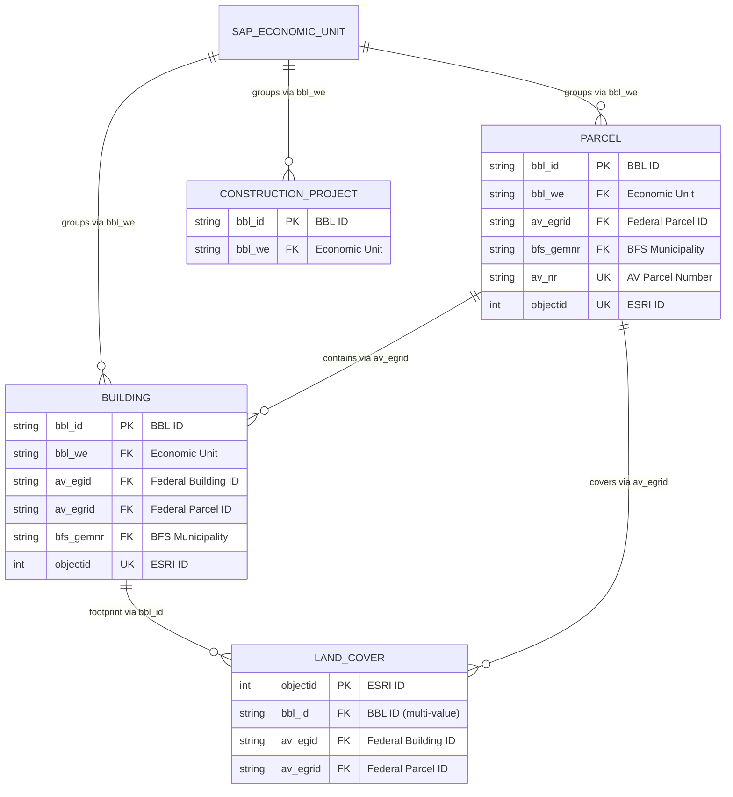

# BBL GIS IMMO — Data Model

> **Canonical source of truth:** [`docs/DATAMODEL.json`](DATAMODEL.json) — machine-readable, all entities, all fields
> **For non-technical users:** [`docs/BBL GIS IMMO 18-03-2026.xlsx`](BBL%20GIS%20IMMO%2018-03-2026.xlsx) — generated from JSON via `python docs/generate_excel.py`
> **Data files:** [`data/buildings.geojson`](../data/buildings.geojson) · [`data/parcels.geojson`](../data/parcels.geojson) · [`data/landcovers.geojson`](../data/landcovers.geojson)
>
> This Markdown is a **human-readable summary**. When in doubt, `DATAMODEL.json` is authoritative.

---

## 1. Overview

This document summarizes the data model for the BBL Immobilienportfolio application — a GIS-based tool for exploring the Swiss federal real estate portfolio managed by the Federal Office for Buildings and Logistics (BBL). The complete field-level specification lives in [`DATAMODEL.json`](DATAMODEL.json).

### 1.1 Design Principles

| Principle | Description |
|-----------|-------------|
| **GIS-first** | All entities are flat, denormalized GeoJSON features optimized for Shapefile compatibility (field names ≤ 10 chars) |
| **Standards compliance** | ISO 8601 dates, ISO 3166 countries, SIA 416/380 for areas and volumes, LV95 Swiss coordinates |
| **Multilingual** | UI supports DE, FR, IT, EN via `data/i18n.json`; field labels translated under `col.*` keys |
| **Traceability** | ETL timestamp (`etl_ts`) tracks last sync from source systems |

### 1.2 Swiss Standards & Identifiers

| Standard / ID | Description | Usage |
|---------------|-------------|-------|
| **EGID** | Eidgenössischer Gebäudeidentifikator | Federal building identification (CH only) |
| **EGRID** | Eidgenössischer Grundstücksidentifikator | Federal parcel identification (CH only) |
| **SIA 416** | Areas and volumes in building construction | Floor areas (GF, NGF, HNF, etc.), volumes (GV), floor counts |
| **SIA 380/1** | Energy performance of buildings | Energy reference area (EBF) |
| **LV95** | Swiss coordinate reference system | Derived from WGS84 for precise Swiss positioning |
| **BFS** | Bundesamt für Statistik municipality directory | Municipality name and number |
| **KGS** | Kulturgüterschutz-Inventar | Cultural property protection category and ID |

### 1.3 Entity Relationship Diagram

The SAP Economic Unit (`bbl_we`) is the commercial key linking Building, Parcel, and Construction Project. Official survey identifiers (EGID, EGRID) provide spatial linkage.



### 1.4 Entity Summary

| Entity | Geometry | Status | Fields | Data file | Description |
|--------|----------|--------|--------|-----------|-------------|
| **Building** | Point | LIVE | 67 LIVE + 7 DEV | `data/buildings.geojson` | Core building records: master data, address, coordinates, survey IDs, heritage, dimensions, financials |
| **Parcel** | Polygon | LIVE | 43 LIVE + 1 DEV | `data/parcels.geojson` | Land parcels: master data, survey IDs, zoning, dimensions, sealed/green area |
| **Land Cover** | Polygon | LIVE | 13 | — (future) | Building footprints and land cover from official Swiss survey |
| **Building Envelope** | Polygon | DEV | 33 | — (future) | 3D building shell with envelope-specific dimensions (eBKP-H) |
| **Construction Project** | Point | DEV | 28 | — (future) | Active construction projects with controlling dates, costs, typology |

### 1.5 Foreign Key Targets

| FK Field | Source Entities | Target / External System | Description |
|----------|----------------|--------------------------|-------------|
| `bbl_we` | Building, Parcel, Constr. Project | SAP RE-FX | Commercial grouping key (Economic Unit) |
| `av_egid` | Building, Land Cover | [GWR](https://www.housing-stat.ch) | Federal building identifier (CH only) |
| `av_egrid` | Building, Land Cover, Parcel | [cadastre.ch](https://www.cadastre.ch) | Federal parcel identifier (CH only) |
| `bfs_gemnr` | Building, Parcel | [BFS Directory](https://www.bfs.admin.ch) | Municipality number |
| `kgs_nr` | Building | [KGS Inventory](https://www.babs.admin.ch) | Cultural property protection ID |
| `fid` | Land Cover, Parcel | External geometry databases | Architecture object ID |
| `bbl_id` | Land Cover | Building / Parcel `bbl_id` | Semicolon-delimited if polygon covers multiple objects |

---

## 2. Building (Gebäude)

**Geometry:** Point · **File:** `data/buildings.geojson` · **67 LIVE attributes, 7 DEV**

The core entity representing a physical structure in the portfolio.

> **Visible** = shown by default in the table widget. Users can toggle any column on/off.

| # | Field | Format | Key | Group | Visible | Description (DE) | Description (EN) |
|---|-------|--------|-----|-------|---------|------------------|------------------|
| 1 | `bbl_id` | String | PK | Master Data | **yes** | Interne BBL ID (Buchungskreis/WE/Teilobjekt) | Internal BBL ID |
| 2 | `bbl_bez` | String | | Master Data | **yes** | Objektbezeichnung entsprechend SAP | Object name per SAP |
| 3 | `bbl_stat` | String | | Master Data | **yes** | Status entsprechend SAP | Record status per SAP |
| 4 | `bbl_buch` | String | | Master Data | | Buchungskreis entsprechend SAP | Company code per SAP |
| 5 | `bbl_we` | String | FK | Master Data | | Wirtschaftseinheit, gruppiert Teilobjekte | Economic unit |
| 6 | `bbl_obj` | String | | Master Data | | Teilobjekt, pro WE indexiert | Subobject number |
| 7 | `bbl_gbda1` | String | | Master Data | **yes** | Gebäudeart Stufe 1 | Building type level 1 |
| 8 | `bbl_gbda2` | String | | Master Data | | Gebäudeart Stufe 2 | Building type level 2 |
| 9 | `bbl_eigen` | String | | Master Data | **yes** | Eigentum Art entsprechend SAP | Ownership type per SAP |
| 10 | `bbl_ostr` | String | | Master Data | | Objektstrategie entsprechend SAP | Object strategy per SAP |
| 11 | `bbl_mietm` | String | | Master Data | | Mietmodell entsprechend SAP | Rental model per SAP |
| 12 | `bbl_port` | String | | Master Data | **yes** | Teilportfolio entsprechend SAP | Subportfolio assignment |
| 13 | `bbl_port2` | String | | Master Data | | Teilportfoliogruppe | Subportfolio group |
| 14 | `bbl_bjahr` | Integer | | Master Data | **yes** | Baujahr | Year of construction |
| 15 | `bbl_vjahr` | Integer | | Master Data | | Verkaufsjahr (leer wenn nicht verkauft) | Year of sale (null if not sold) |
| 16 | `bbl_awrt` | Double | | Financial | | Anschaffungswert in CHF | Acquisition value in CHF |
| 17 | `bbl_bwrt` | Double | | Financial | | Buchwert in CHF | Net book value in CHF |
| 18 | `bbl_ovtw` | String | | People | **yes** | Objektverantwortliche Person | Responsible person |
| 19 | `bbl_pvtw` | String | | People | | Portfoliomanager | Portfolio manager |
| 20 | `adr_land` | String | | Address | **yes** | Land (ISO 3166) | Country |
| 21 | `adr_reg` | String | | Address | | Region oder Kanton | Region or canton |
| 22 | `adr_ort` | String | | Address | **yes** | Ort | City or town |
| 23 | `adr_plz` | String | | Address | | Postleitzahl | Postal code |
| 24 | `adr_str` | String | | Address | | Strasse | Street name |
| 25 | `adr_hsnr` | String | | Address | | Hausnummer | House number |
| 26 | `adr_conct` | String | | Address | **yes** | Verkettet: Strasse + Hausnr + PLZ + Ort | Concatenated address |
| 27 | `wgs84_lat` | Double | | Coordinates | | Breitengrad WGS84 | WGS84 latitude |
| 28 | `wgs84_lon` | Double | | Coordinates | | Längengrad WGS84 | WGS84 longitude |
| 29 | `lv95_e` | Double | | Coordinates | | LV95 Ost, aus WGS84 hergeleitet | LV95 easting |
| 30 | `lv95_n` | Double | | Coordinates | | LV95 Nord, aus WGS84 hergeleitet | LV95 northing |
| 31 | `egm_elev` | Double | | Coordinates | | Absolute Höhe in Meter (EGM2008) | Elevation |
| 32 | `av_egid` | String | FK | Survey | | Eidg. Gebäudeidentifikator (nur CH) | Federal building ID (CH only) |
| 33 | `av_egrid` | String | FK | Survey | | Eidg. Grundstückidentifikator (nur CH) | Federal parcel ID (CH only) |
| 34 | `bfs_gem` | String | | Survey | | BFS Gemeindename | Municipality name |
| 35 | `bfs_gemnr` | String | FK | Survey | | BFS Gemeindenummer | Municipality number |
| 36 | `av_zbez` | String | | Zoning | | Bauzonenbezeichnung | Construction zone name |
| 37 | `av_znut` | String | | Zoning | | Bauzonennutzung | Construction zone usage type |
| 38 | `bbl_hist` | String | | Heritage | | Historische Ausstattung | Historical furnishing |
| 39 | `bbl_arch` | String | | Heritage | | Archivwürdigkeit | Archival value |
| 40 | `kgs_kat` | String | | Heritage | | KGS-Inventar Kategorie (A, B, C) | Cultural protection category |
| 41 | `kgs_nr` | Integer | FK | Heritage | | KGS-Inventar ID | Cultural protection ID |
| 42 | `garea_gf` | Double | | Dimensions | | Geschossfläche GF Total in m² | Total floor area GF |
| 43 | `garea_gfo` | Double | | Dimensions | | GF Oberirdisch in m² | Above-ground floor area |
| 44 | `garea_gfu` | Double | | Dimensions | | GF Unterirdisch in m² | Underground floor area |
| 45 | `garea_acu` | String | | Dimensions | | Genauigkeit Fläche | Floor area accuracy |
| 46 | `garea_ngf` | Double | | Dimensions | **yes** | Netto-Geschossfläche in m² | Net floor area NGF |
| 47 | `garea_nf` | Double | | Dimensions | | Nutzfläche in m² | Usable area NF |
| 48 | `garea_hnf` | Double | | Dimensions | | Hauptnutzfläche in m² | Main usable area HNF |
| 49 | `garea_nnf` | Double | | Dimensions | | Nebennutzfläche in m² | Ancillary area NNF |
| 50 | `garea_ff` | Double | | Dimensions | | Funktionsfläche in m² | Functional area FF |
| 51 | `garea_vf` | Double | | Dimensions | | Verkehrsfläche in m² | Circulation area VF |
| 52 | `garea_vmf` | Double | | Dimensions | | Vermietbare Fläche in m² | Rentable area VMF |
| 53 | `garea_ebf` | Double | | Dimensions | | Energiebezugsfläche in m² (SIA 380) | Energy reference area EBF |
| 54 | `gvol_gv` | Double | | Dimensions | | Gebäudevolumen GV in m³ | Building volume GV |
| 55 | `gvol_gvo` | Double | | Dimensions | | GV Oberirdisch in m³ | Above-ground volume |
| 56 | `gvol_gvu` | Double | | Dimensions | | GV Unterirdisch in m³ | Underground volume |
| 57 | `gvol_acu` | String | | Dimensions | | Genauigkeit Volumen | Volume accuracy |
| 58 | `gastw` | Integer | | Dimensions | **yes** | Anzahl Geschosse Total | Total floor count |
| 59 | `gastw_og` | Integer | | Dimensions | | Geschosse Oberirdisch | Above-ground floors |
| 60 | `gastw_ug` | Integer | | Dimensions | | Geschosse Unterirdisch | Underground floors |
| 61 | `gastw_acu` | String | | Dimensions | | Genauigkeit Geschosse | Floor count accuracy |
| 62 | `larea_ggf` | Double | | Dimensions | | Gebäudegrundfläche in m² | Building footprint GGF |
| 63 | `larea_gsf` | Double | | Dimensions | | Grundstücksfläche in m² | Parcel area GSF |
| 64 | `larea_uf` | Double | | Dimensions | | Umgebungsfläche in m² | Surrounding area UF |
| 65 | `larea_acu` | String | | Dimensions | | Genauigkeit Grundstücksfläche | Land area accuracy |
| 66 | `objectid` | Integer | UK | System | | ESRI ID für GIS-Updates | ESRI system ID |
| 67 | `etl_ts` | Date | | System | | Zeitstempel der letzten ETL-Synchronisation | Timestamp of last ETL sync |
| 68 | `img_url` | Array | | System | | Bild-URLs (App-spezifisch) | Image URLs (app-specific) |
| 90 | `bbl_rgrp` | String | | DEV: Cleaning | | Reinigungsgruppe | Cleaning group |
| 91 | `garea_rff` | Double | | DEV: Cleaning | | Fensterfläche für Reinigung in m² | Window area for cleaning |
| 92 | `garea_rgf` | Double | | DEV: Cleaning | | Glasfläche für Reinigung in m² | Glass area for cleaning |
| 93 | `bbl_api` | Integer | | DEV: Workplaces | | Aktuelle Anzahl Arbeitsplätze | Current workplace count |
| 94 | `bbl_apr` | Integer | | DEV: Workplaces | | Anzahl Reserve-Arbeitsplätze | Reserve workplace count |
| 95 | `bbl_aps` | Integer | | DEV: Workplaces | | Soll-Anzahl Arbeitsplätze | Target workplace count |
| 96 | `av_nrisk` | String | | DEV: Survey | | Naturgefahren-Klassifikation | Natural hazard classification |

### Example (from `data/buildings.geojson`)

```json
{
  "type": "Feature",
  "properties": {
    "bbl_stat": "Aktiv",
    "bbl_id": "1000/4840/AF",
    "bbl_buch": "1000",
    "bbl_we": "4840",
    "bbl_obj": "AF",
    "bbl_bez": "Bundeshaus West",
    "adr_land": "CH",
    "adr_reg": "BE",
    "adr_ort": "Bern",
    "adr_plz": "3003",
    "adr_str": "Bundesplatz",
    "adr_hsnr": "3",
    "adr_conct": "Bundesplatz 3 3003 Bern",
    "wgs84_lat": 46.9465,
    "wgs84_lon": 7.4441,
    "lv95_e": 2600416.2,
    "lv95_n": 1199490.6,
    "bbl_eigen": "Eigentum Bund",
    "bbl_ostr": "Erhalten",
    "bbl_mietm": "Vollkostenmiete",
    "bbl_bjahr": 1902,
    "bbl_port": "Verwaltungsgebäude",
    "bbl_port2": "Bundesverwaltung",
    "bbl_awrt": 85000000.0,
    "bbl_bwrt": 42000000.0,
    "bbl_gbda1": "Verwaltung",
    "bbl_gbda2": "Parlamentsgebäude",
    "bbl_ovtw": "Anna Müller",
    "bbl_pvtw": "Thomas Weber",
    "av_egid": "301001234",
    "av_egrid": "CH938391457759",
    "bfs_gem": "Bern",
    "bfs_gemnr": "351",
    "av_zbez": "Verwaltungszone",
    "av_znut": "Zone für öffentliche Nutzung",
    "bbl_hist": "Ja",
    "bbl_arch": "Ja",
    "kgs_kat": "A",
    "kgs_nr": 1001,
    "garea_gf": 15200.0,
    "garea_gfo": 12800.0,
    "garea_gfu": 2400.0,
    "garea_acu": "Vermessen",
    "garea_ngf": 13100.0,
    "garea_nf": 11500.0,
    "garea_hnf": 9800.0,
    "garea_nnf": 1700.0,
    "garea_ff": 800.0,
    "garea_vf": 800.0,
    "garea_vmf": 10200.0,
    "garea_ebf": 12500.0,
    "gvol_gv": 48500.0,
    "gvol_gvo": 39200.0,
    "gvol_gvu": 9300.0,
    "gvol_acu": "Vermessen",
    "gastw": 5,
    "gastw_og": 4,
    "gastw_ug": 1,
    "gastw_acu": "Vermessen",
    "larea_ggf": 3200.0,
    "larea_gsf": 5100.0,
    "larea_uf": 1900.0,
    "larea_acu": "AV",
    "objectid": 1,
    "etl_ts": "2026-03-18T06:00:00Z",
    "img_url": ["https://images.unsplash.com/..."]
  },
  "geometry": {
    "type": "Point",
    "coordinates": [7.4441, 46.9465]
  }
}
```

---

## 3. Parcel (Grundstück)

**Geometry:** Polygon · **File:** `data/parcels.geojson` · **43 LIVE attributes, 1 DEV**

Land parcels with master data, survey identifiers, zoning, and area dimensions.

| # | Field | Format | Key | Group | Visible | Description (DE) | Description (EN) |
|---|-------|--------|-----|-------|---------|------------------|------------------|
| 1 | `bbl_id` | String | PK | Master Data | **yes** | Interne BBL ID (Buchungskreis/WE/Teilobjekt) | Internal BBL ID |
| 2 | `bbl_bez` | String | | Master Data | **yes** | Objektbezeichnung | Object name |
| 3 | `bbl_stat` | String | | Master Data | | Status entsprechend SAP | Record status per SAP |
| 4 | `bbl_buch` | String | | Master Data | | Buchungskreis | Company code |
| 5 | `bbl_we` | String | FK | Master Data | | Wirtschaftseinheit | Economic unit |
| 6 | `bbl_obj` | String | | Master Data | | Teilobjekt | Subobject number |
| 7 | `bbl_port` | String | | Master Data | | Teilportfolio-Zuordnung | Subportfolio assignment |
| 8 | `bbl_mietm` | String | | Master Data | | Mietmodell | Rental model |
| 9 | `bbl_eigen` | String | | Master Data | **yes** | Eigentum Art | Ownership type |
| 10 | `bbl_awrt` | Double | | Financial | | Anschaffungswert in CHF | Acquisition value |
| 11 | `bbl_bwrt` | Double | | Financial | | Kum. Baumassnahmen in CHF | Cumulative construction expenditure |
| 12 | `bbl_hgart` | Boolean | | Master Data | | Historischer Garten | Historical garden |
| 13 | `adr_land` | String | | Address | | Land | Country |
| 14 | `adr_reg` | String | | Address | **yes** | Region oder Kanton | Region or canton |
| 15 | `adr_ort` | String | | Address | | Ort | City or town |
| 16 | `adr_plz` | String | | Address | | Postleitzahl | Postal code |
| 17 | `adr_str` | String | | Address | | Strasse | Street name |
| 18 | `adr_hsnr` | String | | Address | | Hausnummer | House number |
| 19 | `adr_conct` | String | | Address | | Adresse verkettet | Concatenated address |
| 20 | `wgs84_lat` | Double | | Coordinates | | Breitengrad WGS84 | WGS84 latitude |
| 21 | `wgs84_lon` | Double | | Coordinates | | Längengrad WGS84 | WGS84 longitude |
| 22 | `lv95_e` | Double | | Coordinates | | LV95 Ost | LV95 easting |
| 23 | `lv95_n` | Double | | Coordinates | | LV95 Nord | LV95 northing |
| 24 | `egm_elev` | Double | | Coordinates | | Absolute Höhe in Meter | Elevation (EGM2008) |
| 25 | `av_stat` | String | | Survey | | Status Amtliche Vermessung | Official survey status |
| 26 | `av_egrid` | String | FK | Survey | | Eidg. Grundstückidentifikator | Federal parcel ID (CH only) |
| 27 | `bfs_gem` | String | | Survey | **yes** | BFS Gemeindename | Municipality name |
| 28 | `bfs_gemnr` | String | FK | Survey | | BFS Gemeindenummer | Municipality number |
| 29 | `av_nr` | String | UK | Survey | **yes** | Grundstücksnummer pro Gemeinde | Parcel number |
| 30 | `av_zbez` | String | | Zoning | **yes** | Bauzonenbezeichnung | Construction zone name |
| 31 | `av_znut` | String | | Zoning | | Bauzonennutzung | Construction zone usage type |
| 32 | `larea_ggf` | Double | | Dimensions | | Gebäudegrundfläche in m² | Building footprint GGF |
| 33 | `larea_gsf` | Double | | Dimensions | **yes** | Grundstücksfläche in m² | Parcel area GSF |
| 34 | `larea_uf` | Double | | Dimensions | | Umgebungsfläche in m² | Surrounding area UF |
| 35 | `larea_buf` | Double | | Dimensions | | Bearbeitete Umgebungsfläche in m² | Processed surrounding area BUF |
| 36 | `larea_uuf` | Double | | Dimensions | | Unbearbeitete Umgebungsfläche in m² | Unprocessed surrounding UUF |
| 37 | `larea_acu` | String | | Dimensions | | Genauigkeit | Accuracy |
| 38 | `larea_ver` | Double | | Dimensions | | Versiegelte Fläche in m² | Sealed surface area |
| 39 | `larea_gre` | Double | | Dimensions | | Grünfläche in m² | Green space area |
| 40 | `fid` | String | FK | System | | Architektur-Objekt-ID | External geometry object ID |
| 41 | `fid_src` | String | | System | | Quelle der Geometrie | Source of external geometry |
| 42 | `objectid` | Integer | UK | System | | ESRI ID für GIS-Updates | ESRI system ID |
| 43 | `etl_ts` | Date | | System | | Zeitstempel der letzten ETL-Synchronisation | Timestamp of last ETL sync |
| 90 | `av_nrisk` | String | | DEV: Survey | | Naturgefahren-Klassifikation | Natural hazard classification |

### Example (from `data/parcels.geojson`)

```json
{
  "type": "Feature",
  "properties": {
    "bbl_stat": "Aktiv",
    "bbl_id": "1000/4840/01",
    "bbl_buch": "1000",
    "bbl_we": "4840",
    "bbl_obj": "01",
    "bbl_bez": "Bundesplatz Parzelle A",
    "bbl_port": "Verwaltungsgebäude",
    "bbl_mietm": "Vollkostenmiete",
    "bbl_eigen": "Eigentum Bund",
    "bbl_awrt": 35000000.0,
    "bbl_bwrt": 12000000.0,
    "bbl_hgart": false,
    "adr_land": "CH",
    "adr_reg": "BE",
    "adr_ort": "Bern",
    "av_stat": "Gültig",
    "av_egrid": "CH938391457759",
    "bfs_gem": "Bern",
    "bfs_gemnr": "351",
    "av_nr": "1001",
    "larea_gsf": 5100.0,
    "larea_ver": 3800.0,
    "larea_gre": 1300.0,
    "av_zbez": "Verwaltungszone",
    "objectid": 1,
    "etl_ts": "2026-03-18T06:00:00Z"
  },
  "geometry": {
    "type": "Polygon",
    "coordinates": [[[7.4435, 46.946], [7.4447, 46.946], [7.4447, 46.947], [7.4435, 46.947], [7.4435, 46.946]]]
  }
}
```

---

## 4. Land Cover (Bodenabdeckung)

**Geometry:** Polygon · **File:** `data/landcovers.geojson` · **13 LIVE attributes**

Building footprints and land cover polygons from the official Swiss survey. Linked to Buildings and Parcels via EGID/EGRID. A single polygon may cover multiple buildings (semicolon-delimited `bbl_id`).

| # | Field | Format | Key | Group | Visible | Description (DE) | Description (EN) |
|---|-------|--------|-----|-------|---------|------------------|------------------|
| 1 | `bbl_id` | String | FK | Master Data | **yes** | BBL ID; Semikolon-getrennt bei Mehrfachzuordnung | BBL ID; semicolon-delimited if multi-building |
| 2 | `av_type` | String | | Survey | **yes** | Bodenabdeckungstyp | Land cover type per official survey |
| 3 | `av_stat` | String | | Survey | **yes** | Status Amtliche Vermessung | Official survey status |
| 4 | `av_egid` | String | FK | Survey | **yes** | Eidg. Gebäudeidentifikator (nur CH) | Federal building ID (CH only) |
| 5 | `av_egrid` | String | FK | Survey | **yes** | Eidg. Grundstückidentifikator (nur CH) | Federal parcel ID (CH only) |
| 6 | `wgs84_lat` | Double | | Coordinates | | Breitengrad WGS84 | WGS84 latitude |
| 7 | `wgs84_lon` | Double | | Coordinates | | Längengrad WGS84 | WGS84 longitude |
| 8 | `lv95_e` | Double | | Coordinates | | LV95 Ost | LV95 easting |
| 9 | `lv95_n` | Double | | Coordinates | | LV95 Nord | LV95 northing |
| 10 | `fid` | String | FK | System | | Architektur-Objekt-ID | External geometry object ID |
| 11 | `fid_src` | String | | System | | Quelle der Geometrie | Source of external geometry |
| 12 | `objectid` | Integer | PK | System | **yes** | ESRI ID für GIS-Updates | ESRI system ID |
| 13 | `etl_ts` | Date | | System | | Zeitstempel der letzten ETL-Synchronisation | Timestamp of last ETL sync |

---

## 5. Future Development (DEV)

These entities are defined in the data model but not yet in production.

### 5.1 Building Envelope (Gebäudehülle)

**Geometry:** Polygon · **33 DEV attributes**

3D building shell geometry with envelope-specific dimensions. Shares most fields with Building (address, coordinates, SIA 416 dimensions) plus:

| Field | Format | Description (EN) |
|-------|--------|------------------|
| `garea_daf` | Double | Roof area DAF (eBKP-H) in m² |
| `garea_awf` | Double | Exterior wall area AWF (eBKP-H) in m² |
| `garea_ebf` | Double | Energy reference area EBF (SIA 380) in m² |

### 5.2 Construction Project (Bauprojekt)

**Geometry:** Point · **28 DEV attributes**

Active construction projects with project controlling data. Key fields beyond standard master data and address:

| Field | Format | Description (EN) |
|-------|--------|------------------|
| `bbl_ptag` | String | Client type |
| `bbl_partb` | String | Structure category |
| `bbl_ptypb` | String | Structure type |
| `bbl_part` | String | Project type (new build, renovation, etc.) |
| `bbl_pkost` | Double | Total project cost in CHF |
| `bbl_pdtin` | Date | Building submission date |
| `bbl_pdtok` | Date | Building permit date |
| `bbl_pdtbb` | Date | Construction start date |
| `bbl_pdtbe` | Date | Planned or actual construction end date |
| `bbl_pvbd` | String | Estimated construction duration |
| `bbl_ptxt1` | String | Free text for project notes |
| `bbl_ptxt2` | String | Free text for project notes |

---

## 6. Value Lists

Value lists constrain specific fields to defined sets of values. Maintained in the **Werteliste** sheet of the source Excel.

| Value List | Used By | Constrained Field(s) | Example Values |
|------------|---------|---------------------|----------------|
| `bbl_stat` | Building, Parcel, Constr. Project | `bbl_stat` | Aktiv, In Renovation, In Planung, Verkauft |
| `bbl_eigen` | Building, Parcel | `bbl_eigen` | Eigentum Bund, Miete |
| `bbl_ostr` | Building | `bbl_ostr` | Erhalten, Optimieren, Veräussern |
| `bbl_mietm` | Building, Parcel | `bbl_mietm` | Vollkostenmiete, Kostenmiete, Marktmiete |
| `bbl_port` | Building, Parcel | `bbl_port` | Verwaltungsgebäude, Zivile Bauten, ... |
| `bbl_port2` | Building | `bbl_port2` | Bundesverwaltung, Zoll, ... |
| `bbl_gbda1` | Building | `bbl_gbda1` | Verwaltung, Wohnen, Lager, ... |
| `bbl_gbda2` | Building | `bbl_gbda2` | Parlamentsgebäude, Bürogebäude, ... |
| `bbl_hist` | Building | `bbl_hist` | Ja, Nein |
| `bbl_arch` | Building | `bbl_arch` | Ja, Nein |
| `kgs_kat` | Building | `kgs_kat` | A, B, C |
| `av_stat` | Land Cover, Parcel | `av_stat` | Gültig, Projektiert |
| `av_type` | Land Cover | `av_type` | Gebäude, ... |
| `adr_land` | All entities | `adr_land` | CH, DE, FR, IT, AT, BE, US (ISO 3166) |
| `adr_reg` | All entities | `adr_reg` | BE, ZH, GE, Berlin, ... |
| `garea_acu` | Building, Envelope | `garea_acu`, `gvol_acu`, `gastw_acu` | Vermessen, Geschätzt, AV |
| `larea_acu` | Building, Parcel, Envelope | `larea_acu` | Vermessen, Geschätzt, AV |

---

## 7. Internationalisation (i18n)

The application supports four languages via `data/i18n.json`:

| Language | Key | Locale | Label |
|----------|-----|--------|-------|
| German | `de` | `de-CH` | Deutsch |
| French | `fr` | `fr-CH` | Français |
| Italian | `it` | `it-CH` | Italiano |
| English | `en` | `en-CH` | English |

**Key concepts:**

- Translation keys use dot-separated namespaces: `col.bbl_bez`, `pagination.info`, `header.search.placeholder`
- Parameters use `{param}` placeholders: `"Seite {current} von {total}"`
- HTML elements use `data-i18n` attributes; also `data-i18n-placeholder`, `data-i18n-title`, `data-i18n-aria-label`, `data-i18n-alt`
- Language detection priority: URL `?lang=fr` → `localStorage` → browser language → fallback `de`

**Key field label translations:**

| Field | DE | FR | EN |
|-------|----|----|-----|
| `bbl_id` | ID | ID | ID |
| `bbl_bez` | Bezeichnung | Désignation | Description |
| `bbl_stat` | Status | Statut | Status |
| `bbl_eigen` | Art Eigentum | Type de propriété | Ownership type |
| `bbl_port` | Teilportfolio | Sous-portefeuille | Sub-portfolio |
| `adr_land` | Land | Pays | Country |
| `adr_ort` | Ort | Localité | City |
| `garea_gf` | GF | SP | GF |
| `garea_ngf` | NGF | SUP | NGF |
| `garea_ebf` | EBF | SRE | EBF |
| `larea_gsf` | GSF | ST | GSF |

> Full translations are maintained in `data/i18n.json` under each language's `col.*` keys.

---

## 8. Optional Entities (Application-Level)

The following entities are modeled in the application UI but not part of the core GIS feature layers. They are designed for future backend integration. Currently, the detail view renders empty tables for these.

| Entity | Relationship | Purpose |
|--------|-------------|---------|
| **Area Measurement** (Bemessung) | 1 Building → n | Detailed area/volume measurements (SIA 416) with accuracy, standard, validity period |
| **Document** (Dokument) | n Buildings → n | Floor plans, certificates, permits, photographs |
| **Contact** (Kontakt) | n Buildings → n | Property managers, caretakers, portfolio managers |
| **Contract** (Vertrag) | n Buildings → n | Maintenance contracts, lease agreements, insurance |
| **Cost** (Kosten) | n Buildings → n | Operating costs by SN 506 511 cost groups |
| **Asset** (Ausstattung) | n Buildings → n | HVAC, elevators, fire protection, electrical systems |

These entities share a common pattern: a primary key (`*Id`), a `buildingIds` foreign key array, `validFrom`/`validUntil` temporal fields, and an `extensionData` object for custom data.

---

## 9. References

- [SIA 416](https://www.sia.ch/) — Areas and volumes in building construction
- [SIA 380/1](https://www.sia.ch/) — Energy performance of buildings
- [SN 506 511](https://www.snv.ch/) — Building operating costs
- [ISO 8601](https://www.iso.org/iso-8601-date-and-time-format.html) — Date and time format
- [ISO 3166](https://www.iso.org/iso-3166-country-codes.html) — Country codes
- [GeoJSON Specification](https://geojson.org/) — Geographic JSON format
- [LV95](https://www.swisstopo.admin.ch/) — Swiss coordinate reference system
- [EGID/EGRID](https://www.bfs.admin.ch/bfs/de/home/register/gebaeude-wohnungsregister.html) — Swiss Federal Building/Property Identifiers
