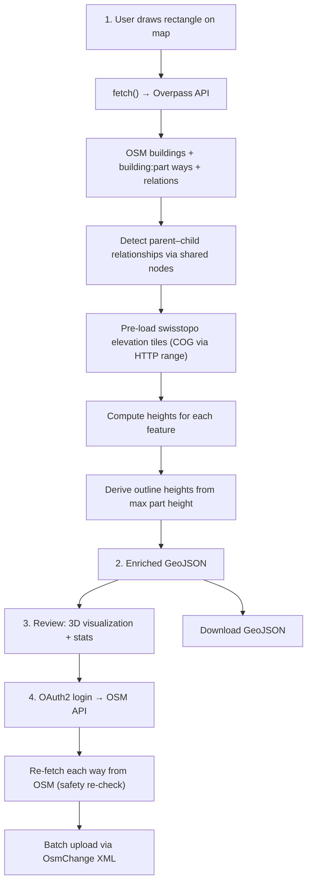
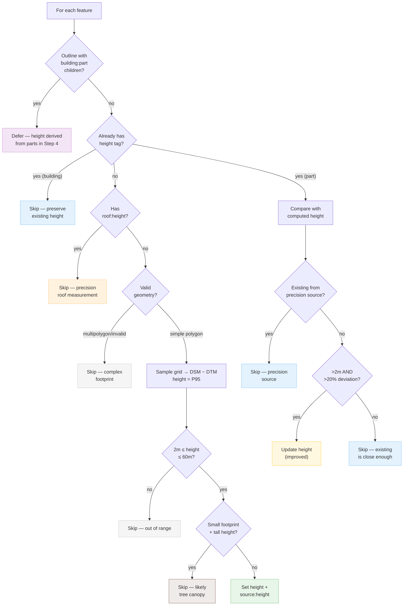
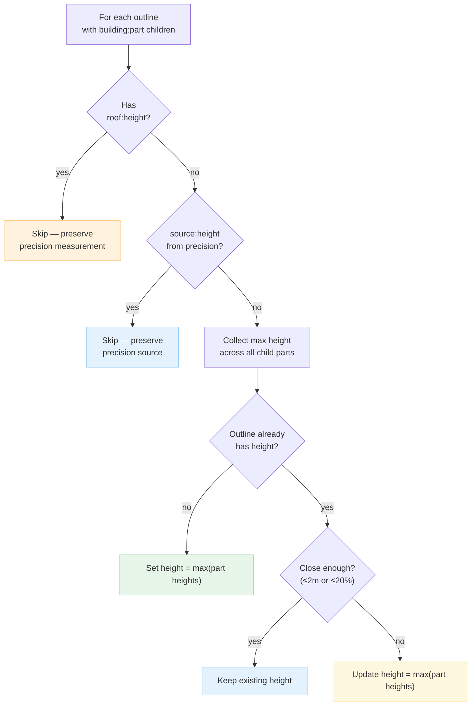
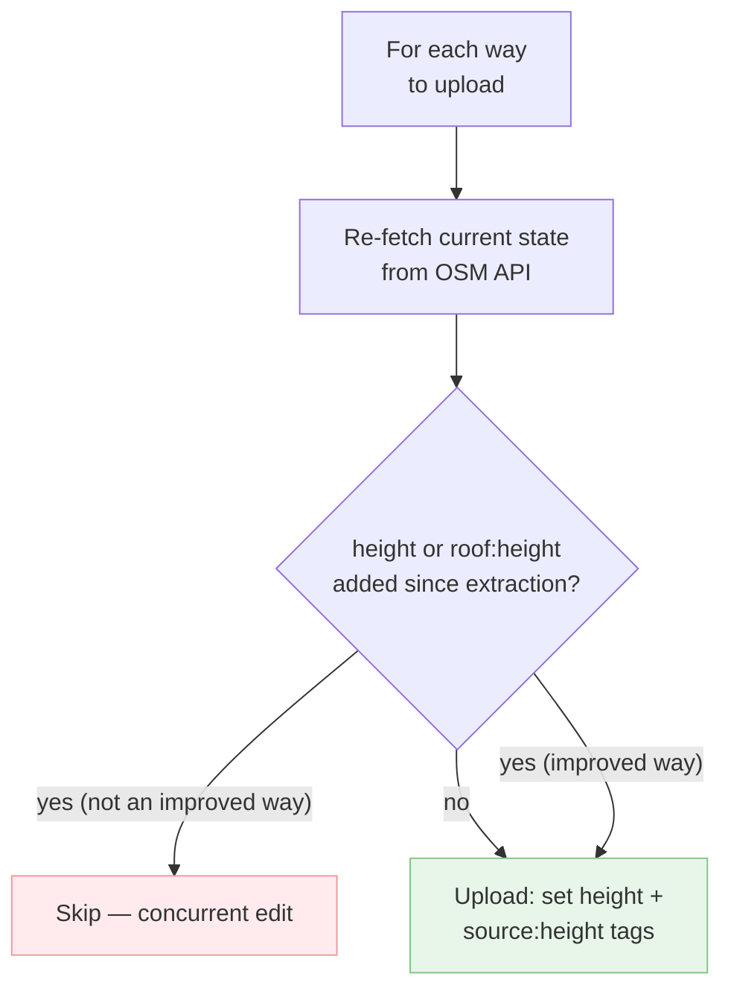

# OSM Building Height Enrichment

Add accurate building heights to OpenStreetMap using Swiss open government elevation data. Runs entirely in the browser — no server, no build step, no dependencies.

## Quick start

- Web App: https://bbl-dres.github.io/property-inventory/osm-height

```bash
# Option A: Open directly
open index.html

# Option B: Local server (if browser blocks fetch from file://)
python -m http.server 8080
# Open http://localhost:8080
```

1. Draw a rectangle on the map to select an area
2. Click **Run Pipeline**
3. Wait for height computation (progress shown in real-time)
4. Click **Show 3D on Map** to visualize results
5. Click **Download GeoJSON** to save the enriched data

## How it works

### Pipeline overview



### Per-feature enrichment logic



### Outline height derivation (Step 4)



### Upload safety re-checks



For each building, a grid of sample points (2m spacing) is created inside the footprint.
At each point, terrain (DTM) and surface (DSM) elevations are read directly from
swisstopo Cloud Optimized GeoTIFF (COG) files via HTTP range requests — no download needed.
The building height is computed as:

```
height_i = DSM_i − DTM_i         (per-point height above ground)
height   = P95(height_i)          (95th percentile of all sample points)
```

The per-point difference accounts for sloped terrain correctly — each sample
measures roof height relative to the ground directly beneath it.
The 95th percentile filters outliers from chimneys, antennas, and overhanging trees.
`max()` would overestimate due to these point features in the DSM.

This matches the [OSM height definition](https://wiki.openstreetmap.org/wiki/Key:height):
*"the distance between the top edge of the building (including roof, excluding antennas)
and the lowest point at the bottom where the building meets the terrain."*

## Data sources

| Data | Source | License | Access |
|------|--------|---------|--------|
| Building footprints | [OpenStreetMap](https://www.openstreetmap.org) | ODbL | Overpass API |
| Terrain elevation (DTM) | [swissALTI3D](https://www.swisstopo.admin.ch/de/hoehenmodell-swissalti3d) | OGD | COG via HTTP range |
| Surface elevation (DSM) | [swissSURFACE3D](https://www.swisstopo.admin.ch/de/hoehenmodell-swisssurface3d-raster) | OGD | COG via HTTP range |

No data downloads required — elevation tiles are read on-the-fly from swisstopo's CDN
using Cloud Optimized GeoTIFF range requests.

## OSM tags

Only two tags are added per building or building:part. No geometry or other tags are modified.

| Tag | Example | Description |
|-----|---------|-------------|
| `height` | `19.2` | 95th percentile height in meters (decimal, no unit suffix) |
| `source:height` | `swisstopo/swissALTI3D;swissSURFACE3D` | Data source attribution |

For buildings with `building:part` children, each part gets its own computed height.
The parent outline receives the **maximum** height across all its parts (per the
[Simple 3D Buildings](https://wiki.openstreetmap.org/wiki/Simple_3D_Buildings) spec).

## Safety filters

The pipeline is designed to be **non-destructive** — it only adds missing data, never
modifies existing tags or geometry. Only two tags are ever written: `height` and
`source:height`. The following rules ensure existing data is respected.

### Buildings (outlines without parts)

| Condition | Action | Map color |
|-----------|--------|-----------|
| Has `height` tag | Skip — preserve existing | Blue |
| Has `roof:height` tag | Skip — precision measurement | Orange |
| Has `source:height` from precision source | Skip — never override | Blue |
| Multipolygon geometry (holes) | Skip — grid sampling unreliable | Grey |
| Height < 2m or > 60m | Skip — out of plausible range | Grey |
| Footprint < 100 m² and slenderness > 1.5 | Skip — likely tree canopy | Brown |
| No swisstopo elevation coverage | Skip — no data | Grey |
| All checks pass | Enrich with computed height | Green |

### Building parts (`building:part`)

Building parts follow the same filters as buildings, with two differences:

- **Existing height is compared, not skipped.** If a part already has a `height` tag:
  - From a precision source (`survey`, `cadastre`, `lidar`, `gps`, `gnss`, `laser`) → never override
  - Otherwise: update only if deviation is **> 2m AND > 20%** — avoids overriding good data with marginal differences
  - The previous value is preserved as `_prev_height` for review before upload

### Building outlines with parts

Per the [OSM Simple 3D Buildings](https://wiki.openstreetmap.org/wiki/Simple_3D_Buildings) spec,
building outlines carry the **overall height** as metadata (used by 2D renderers and
data consumers), while 3D renderers use only the part heights.

After all parts are enriched, each parent outline's height is derived as the
**maximum height** across its child `building:part` features:

- Has `roof:height` on the outline → skip
- Has `source:height` from precision source → skip
- Existing height is close enough (≤ 2m or ≤ 20% deviation) → keep existing
- Otherwise → set outline height to max(part heights)

### Tags that are NOT skipped

- `roof:shape` — defines shape (gabled, hipped, etc.) but not total height. Adding
  `height` actually helps: the renderer calculates `wall = height - roof:height`.
- `roof:levels` — informational (floor count in roof), safe to enrich
- `roof:colour`, `roof:material` — cosmetic, no geometric conflict
- `building:levels` — floor count estimate, not a measured height

### Upload re-checks

At upload time, each way is **re-fetched from OSM** and checked for concurrent edits:

- If `height` was added since extraction → skip (unless this is an intentional update of an existing value)
- If `roof:height` was added since extraction → skip
- This prevents conflicts with other mappers' edits between extraction and upload

## Upload to OSM

The tool supports uploading enriched heights directly to OpenStreetMap via OAuth2.

### Setup

1. Register an OAuth2 app at https://www.openstreetmap.org/oauth2/applications
   - **Name**: `OSM Building Height Enrichment`
   - **Redirect URI**: your deployment URL (e.g. `https://yourname.github.io/...`)
   - **Confidential**: No (uncheck)
   - **Permissions**: `Modify the map` + `Read user preferences`
2. Copy the Client ID into the tool's Step 4
3. Click "Login with OpenStreetMap" to authorize

### Rate limits

OSM enforces rate limits on edits ([source](https://github.com/openstreetmap/openstreetmap-website/pull/4319)):

| Account age | Limit |
|------------|-------|
| New (< 1 day) | ~1,000 changes/hour |
| 1 week | ~100,000 changes/hour |
| With `importer` role | Higher (granted by moderators) |

The limit ramps up quadratically over the first week. Each modified way counts as
1 change. A **rate limit slider** in Step 4 lets you control the upload speed
(default: 1,000 edits/hour, range: 100–5,000). The tool handles rate limits automatically:

- Uploads in batches of 50 elements, paced by the slider setting
- On 429 (rate limited): retries with progressive backoff (30s → 60s → 90s → ...)
- After each rate limit hit, future batch delays increase
- Up to 10 retries before giving up on a batch

**For large uploads (>1,000 buildings):** wait until your account is at least 1 week old,
or request the `importer` role from OSM moderators.

### Upload batching

- OsmChange XML is used for efficient batch uploads (1 HTTP request per batch)
- Ways are batch-fetched (`GET /api/0.6/ways?ways=id1,id2,...`) before upload
- Changesets are automatically split at 9,000 elements (below OSM's 10K limit)

### Import guidelines

For large-scale imports, follow the [OSM Import Guidelines](https://wiki.openstreetmap.org/wiki/Import/Guidelines):
1. Document the import on the OSM wiki
2. Use a dedicated account (e.g. `swisstopo_height_import`)
3. Announce on the Swiss OSM mailing list
4. Wait 2 weeks for community feedback

## Technology

Single HTML file using:
- [MapLibre GL JS](https://maplibre.org/) — map + 3D visualization
- [geotiff.js](https://geotiffjs.github.io/) — read Cloud Optimized GeoTIFF in browser
- [proj4js](http://proj4js.org/) — WGS84 ↔ LV95 coordinate transform
- [Overpass API](https://overpass.osm.ch/) — OSM data extraction

No npm, no webpack, no build step, no server-side code.

## Known limitations

- **Vegetation**: DSM includes tree canopy — buildings under/near trees may have inflated heights (mitigated by P95)
- **Temporal mismatch**: DTM and DSM tiles may be from different years (2017–2025)
- **Small footprints**: Very small buildings may use a single sample point (centroid), less accurate
- **Spires/antennas**: filtered by P95 + 60m max threshold, but short spires on small buildings may still inflate values
- **Area size limit**: hard limit at 25 km² per run; recommended < 2 km² for best performance
- **Swiss coverage only**: swisstopo elevation data covers Switzerland; buildings outside are skipped
- **Relations**: multipolygon buildings are extracted and computed but **not uploaded** (upload not yet supported)
- **Rate limits**: new OSM accounts are limited to ~1,000 edits/hour; the tool retries automatically but large uploads may take time

## Python version

A full Python pipeline with OSM upload support is available in `python_version/`:

```bash
cd python_version
pip install -r requirements.txt
python main.py --bbox "7.443,46.945,7.455,46.950"
python main.py --bbox "7.443,46.945,7.455,46.950" --upload
```

## Future consideration: 3D viewer with `building:part` support

The main property inventory app uses Carto vector tiles for 3D extrusion, which only
provide the `building` source-layer — no `building:part`. This means complex buildings
are rendered as a single flat block instead of showing varying heights for wings, towers,
or annexes.

**Possible improvement:** keep Carto for 2D rendering and add a dedicated
[OpenMapTiles](https://openmaptiles.org/) vector tile source (e.g., via
[MapTiler free tier](https://www.maptiler.com/cloud/) or self-hosted
[Versatiles](https://versatiles.org/)/PMTiles) specifically for the 3D layer. OpenMapTiles
includes `building:part` with `render_height` and `render_min_height`, enabling proper
multi-level extrusion. This would also fix the current issue where 3D buildings don't
appear when the swissimage (aerial) basemap is active, since raster-only styles have
no vector building data.

## Related

- [area-estimator](https://github.com/DavidRasner/area-estimator) — building volume and floor area estimation using the same DSM/DTM approach
- [RESEARCH.md](RESEARCH.md) — detailed research notes on data sources, OSM tagging spec, and import guidelines
