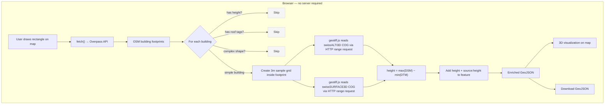

# OSM Building Height Enrichment

Add accurate building heights to OpenStreetMap using Swiss open government elevation data. Runs entirely in the browser — no server, no build step, no dependencies.

## Quick start

```bash
# Option A: Open directly
open index.html

# Option B: Local server (if browser blocks fetch from file://)
python -m http.server 8080
# Open http://localhost:8080
```

1. Draw a rectangle on the map to select an area
2. Click **Run Pipeline**
3. Wait for height computation (progress shown in real-time)
4. Click **Show 3D on Map** to visualize results
5. Click **Download GeoJSON** to save the enriched data

## How it works



For each building, a grid of sample points (3m spacing) is created inside the footprint.
At each point, terrain (DTM) and surface (DSM) elevations are read directly from
swisstopo Cloud Optimized GeoTIFF (COG) files via HTTP range requests — no download needed.
The building height is computed as:

```
height = max(DSM inside footprint) − min(DTM inside footprint)
       = roof ridge − lowest ground contact
```

This matches the [OSM height definition](https://wiki.openstreetmap.org/wiki/Key:height):
*"the distance between the top edge of the building (including roof, excluding antennas)
and the lowest point at the bottom where the building meets the terrain."*

## Data sources

| Data | Source | License | Access |
|------|--------|---------|--------|
| Building footprints | [OpenStreetMap](https://www.openstreetmap.org) | ODbL | Overpass API |
| Terrain elevation (DTM) | [swissALTI3D](https://www.swisstopo.admin.ch/de/hoehenmodell-swissalti3d) | OGD | COG via HTTP range |
| Surface elevation (DSM) | [swissSURFACE3D](https://www.swisstopo.admin.ch/de/hoehenmodell-swisssurface3d-raster) | OGD | COG via HTTP range |

No data downloads required — elevation tiles are read on-the-fly from swisstopo's CDN
using Cloud Optimized GeoTIFF range requests.

## OSM tags

Only two tags are added per building. No geometry or other tags are modified.

| Tag | Example | Description |
|-----|---------|-------------|
| `height` | `19.2` | Max height in meters (decimal, no unit suffix) |
| `source:height` | `swisstopo/swissALTI3D;swissSURFACE3D` | Data source attribution |

## Safety filters

The pipeline is designed to be **non-destructive** — it only adds missing data, never
modifies existing tags or geometry. Buildings are skipped for the following reasons:

### Already has height (blue on map)

Buildings with an existing `height` tag are never modified. The original value is
preserved regardless of whether it matches our computation.

### Measured roof height (orange on map)

Buildings with a `roof:height` tag are skipped. This tag means someone already
measured the building precisely — our DSM-based estimate could be less accurate.

Tags that are **not** skipped:
- `roof:shape` — defines shape (gabled, hipped, etc.) but not total height. Adding
  `height` actually helps: the renderer calculates `wall = height - roof:height`.
- `roof:levels` — informational (floor count in roof), safe to enrich
- `roof:colour`, `roof:material` — cosmetic, no geometric conflict

### Complex footprint (grey on map)

Buildings with multipolygon geometry (holes in the footprint) are skipped.
The grid sampling could hit the open courtyard, producing incorrect heights.

Single-ring polygons of any vertex count are processed — even detailed
footprints like the Bundeshaus (106 vertices) work fine.

### Height out of range (grey on map)

Computed heights outside a plausible range are discarded:
- **< 2m** — likely noise, sheds, or measurement error
- **\> 60m** — likely spires, antennas, cranes, or vegetation artifacts in the DSM

### No elevation data

Buildings in areas without swisstopo coverage (outside Switzerland) or where
elevation tiles are unavailable are skipped silently.

### Upload re-checks

At upload time, each building is re-fetched from OSM and checked again:
- If `height` was added since extraction → skip
- If `roof:shape` or `roof:height` was added since extraction → skip
- This prevents conflicts with concurrent OSM edits

## Technology

Single HTML file using:
- [MapLibre GL JS](https://maplibre.org/) — map + 3D visualization
- [geotiff.js](https://geotiffjs.github.io/) — read Cloud Optimized GeoTIFF in browser
- [proj4js](http://proj4js.org/) — WGS84 ↔ LV95 coordinate transform
- [Overpass API](https://overpass.osm.ch/) — OSM data extraction

No npm, no webpack, no build step, no server-side code.

## Known limitations

- **Vegetation**: DSM includes tree canopy — buildings under/near trees may have inflated heights
- **Temporal mismatch**: DTM and DSM tiles may be from different years (2017–2025)
- **Small footprints**: Buildings < 2m² use a single sample point (centroid), less accurate
- **Spires/antennas**: filtered by 60m max threshold, but short spires may still inflate values
- **Area size**: recommended < 1 km² per run for browser performance; larger areas work but take longer
- **Swiss coverage only**: swisstopo elevation data covers Switzerland; buildings outside are skipped

## Python version

A full Python pipeline with OSM upload support is available in `python_version/`:

```bash
cd python_version
pip install -r requirements.txt
python main.py --bbox "7.443,46.945,7.455,46.950"
python main.py --bbox "7.443,46.945,7.455,46.950" --upload
```

## Related

- [area-estimator](https://github.com/DavidRasner/area-estimator) — building volume and floor area estimation using the same DSM/DTM approach
- [RESEARCH.md](RESEARCH.md) — detailed research notes on data sources, OSM tagging spec, and import guidelines
